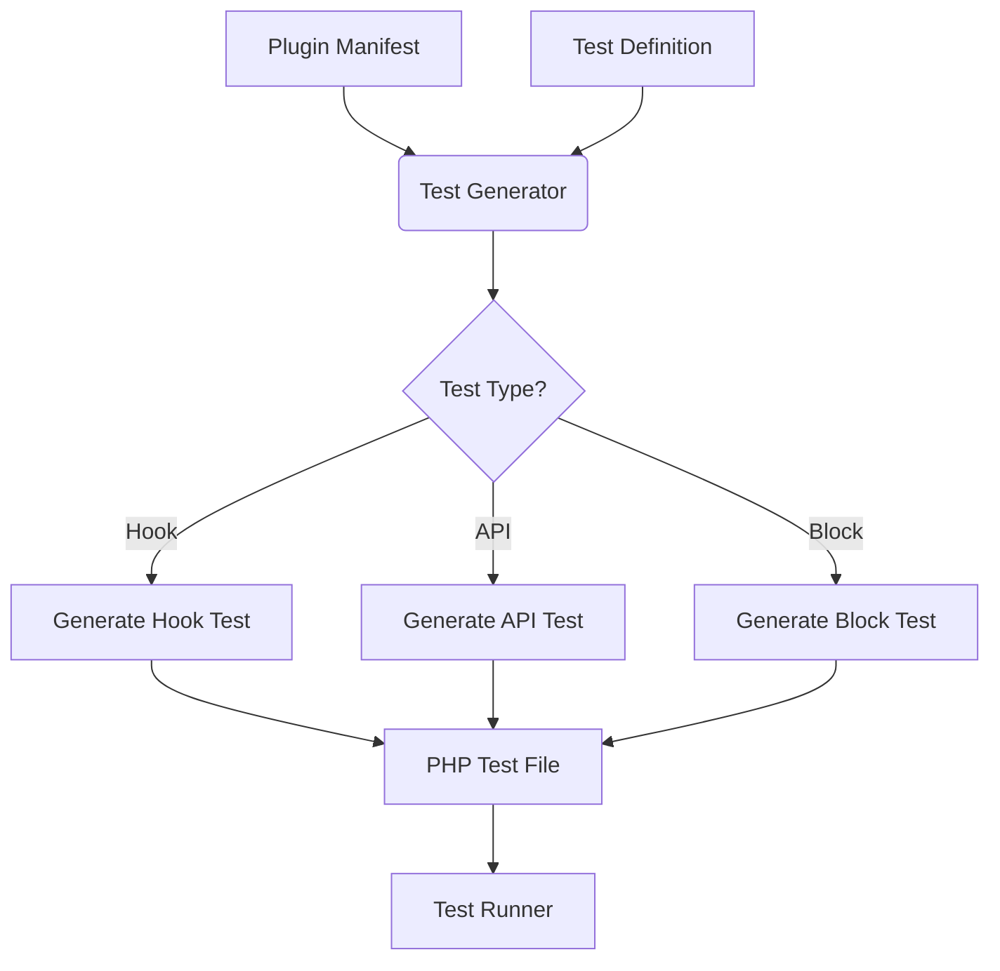

# Dynamic Test Generator System

## Overview
Automated test generation for CMS plugins, blocks, and API endpoints. Integrates with existing Dev Toolkit and test runner.

## Architecture

## Components

1. **Test Definition Format** (YAML/JSON)
2. **Generator Core** (PHP)
3. **Dev Toolkit Integration**
4. **Test Runner Adapter**

## Implementation Phases

1. Core generator engine
2. YAML/JSON parser
3. UI integration
4. Test runner compatibility