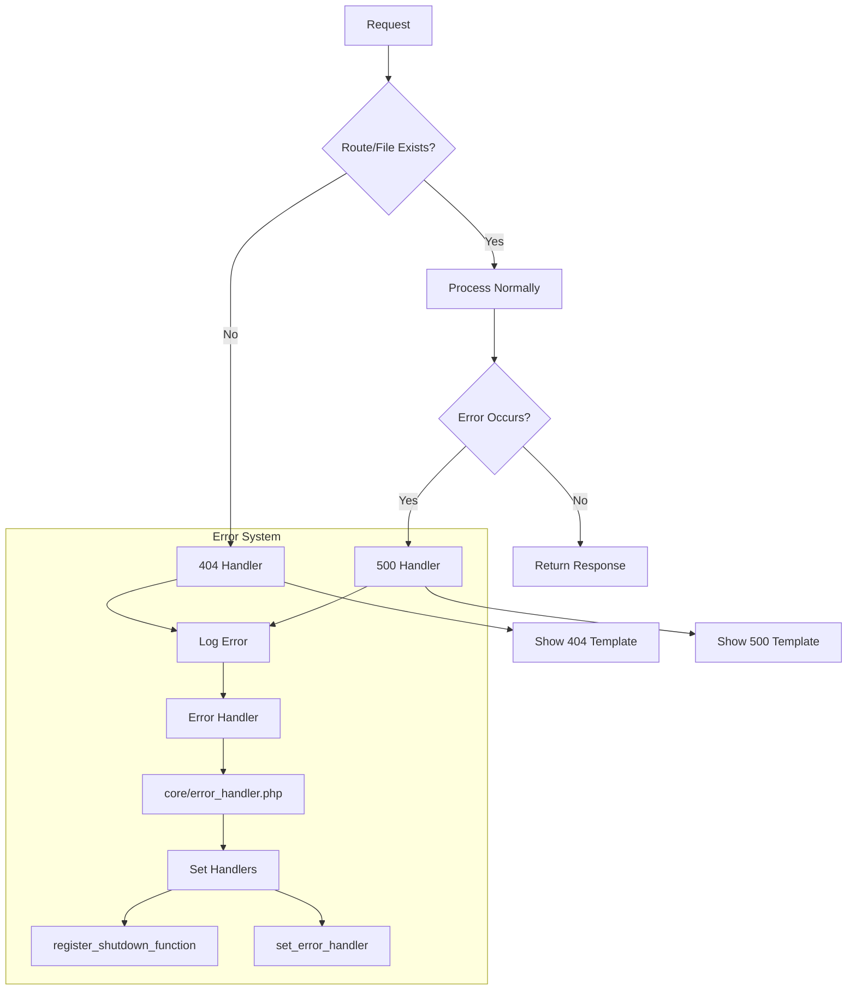

# Error Handling System Plan

## Overview
Implement a global error handling system for the CMS that:
1. Uses `set_error_handler()` and `register_shutdown_function()`
2. Redirects to `views/errors/404.php` for missing routes/files
3. Redirects to new `views/errors/500.php` for server errors
4. Is implemented in `core/error_handler.php`
5. Follows project's modular PHP requirements
6. Is FTP-deployable with no framework dependencies

## Architecture


## Implementation Details

### 1. core/error_handler.php
```php
<?php
define('ERROR_LOG_FILE', __DIR__.'/../logs/errors.log');

function logError($message, $context = []) {
    // Implementation details...
}

function handleError($errno, $errstr, $errfile, $errline) {
    // Implementation details...
}

function handleShutdown() {
    // Implementation details...
}

function handle404() {
    // Implementation details...
}

// Register handlers
set_error_handler('handleError');
register_shutdown_function('handleShutdown');
```

### 2. views/errors/500.php
```php
<!DOCTYPE html>
<html lang="en">
<!-- Template matching 404.php style -->
</html>
```

### 3. Integration
- Add to `index.php`:
```php
require_once __DIR__.'/core/error_handler.php';
```

### 4. Logs directory
- Create `logs/` directory with `.htaccess` to block web access

## Next Steps
1. Create logs directory with proper permissions
2. Implement core/error_handler.php
3. Create views/errors/500.php
4. Update index.php to include error handler
5. Test error scenarios