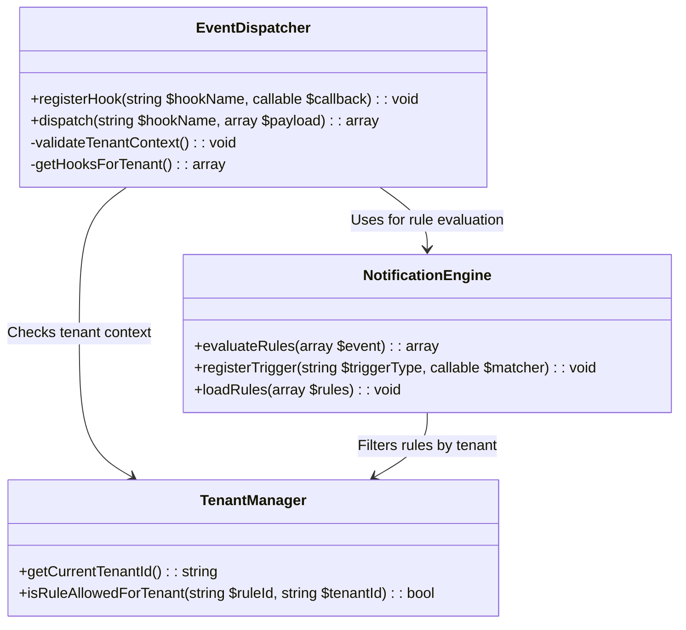

# Event Dispatcher Architecture Plan

## Overview
Lightweight event dispatcher system integrating with existing notification rules engine while adding system hooks functionality.

## Core Components



## Implementation Details

### 1. EventDispatcher Class
```php
class EventDispatcher {
    private TenantManager $tenantManager;
    private array $hooks = [];
    
    public function __construct(TenantManager $tenantManager) {
        $this->tenantManager = $tenantManager;
    }
    
    public function registerHook(string $hookName, callable $callback): void {
        $this->hooks[$hookName][] = $callback;
    }
    
    public function dispatch(string $hookName, array $payload): array {
        $this->validateTenantContext();
        $results = [];
        
        foreach ($this->getHooksForTenant($hookName) as $hook) {
            $results[] = $hook($payload);
        }
        
        return $results;
    }
    
    // ... other methods
}
```

### 2. System Hooks
- `core_init`: System initialization
- `pre_render`: Before template rendering
- `post_save`: After content save  
- `user_login`: After successful login

### 3. Database Schema
```sql
CREATE TABLE system_hooks (
    id VARCHAR(36) PRIMARY KEY,
    name VARCHAR(64) NOT NULL,
    description TEXT,
    created_at TIMESTAMP DEFAULT CURRENT_TIMESTAMP
);
```

### 4. Integration Points
- Reuse NotificationEngine's rule evaluation
- Extend trigger registry for new hooks
- Maintain tenant isolation
- Preserve existing notification actions

## Implementation Steps
1. Create `/includes/event_dispatcher.php`
2. Implement core dispatcher class
3. Add system hook definitions
4. Integrate with notification engine
5. Create database migration
6. Add admin interface for hook management