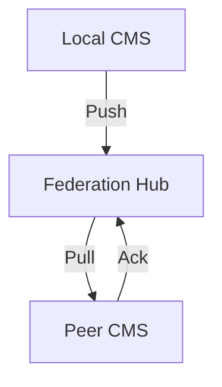
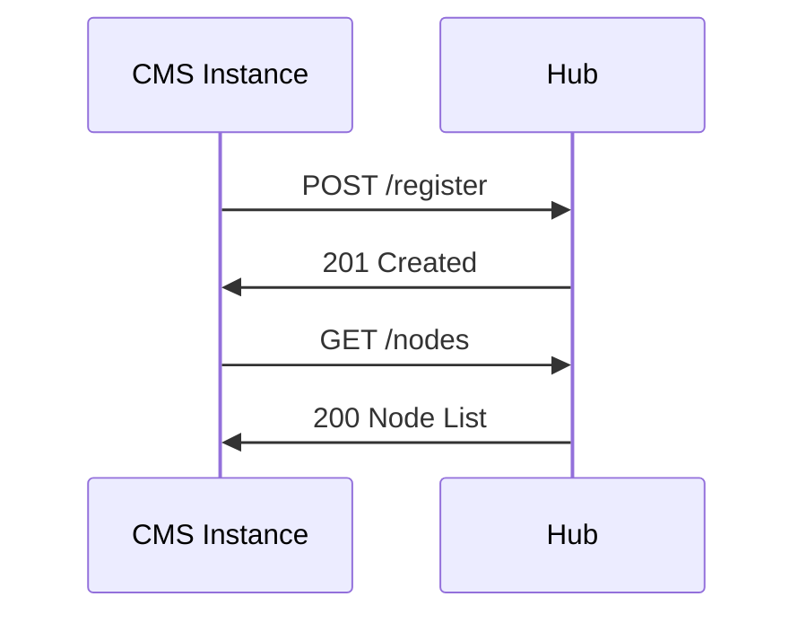

# Content Federation Architecture (Phase 12)

## System Components

### 1. Content Syndication Protocol

### 2. Node Registration & Discovery

### 3. Conflict Resolution
- Timestamp-based detection
- Content hash comparison
- Three-way merge strategy
- Manual resolution fallback

### 4. Change Propagation
- Webhook notifications
- Periodic sync
- Content digest
- Ack protocol

## Implementation Requirements

1. **REST API Endpoints**:
   - `/federation/register`
   - `/federation/nodes` 
   - `/federation/push`
   - `/federation/pull`
   - `/federation/conflicts`

2. **Shared Hosting**:
   - No persistent processes  
   - Cron-based sync
   - Minimal memory
   - DB-agnostic

3. **Backward Compatibility**:
   - Optional features
   - Graceful degradation
   - Version negotiation

## Deliverables Timeline

1. Week 1: Architecture spec
2. Week 2: Node protocol  
3. Week 3: Conflict resolution
4. Week 4: Security model