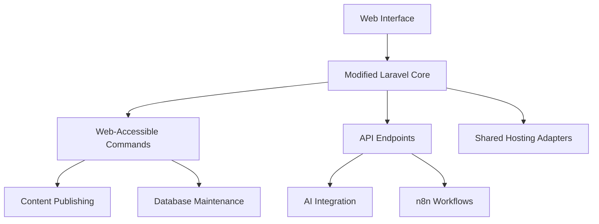

# CMS Architecture Plan (Modified for Shared Hosting)

## Current State Analysis
- Laravel framework in use (conflicts with original constraints)
- Artisan commands being used for scheduled tasks
- Modular structure partially implemented
- AI integration endpoints exist but need optimization

## Proposed Modifications

### Key Changes:
1. **Artisan Command Replacement**
   - Convert all CLI commands to web-accessible endpoints
   - Secure with HTTP Basic Auth
   - Example: `/run-command/publish-scheduled`

2. **Shared Hosting Adaptations**
   - File-based queue system instead of Redis
   - Simplified cache driver (file instead of redis)
   - Web-based installation process

3. **Core Modules**
   - Page Builder (drag-and-drop)
   - Theme Engine (file-based templates)
   - Plugin System (auto-loading from /plugins)
   - Admin Panel (web-based management)

4. **AI Integration**
   - REST API endpoints for:
     - Content generation
     - Content validation
     - Revision suggestions

## Implementation Phases

1. **Phase 1 (1 week)**
   - Replace all Artisan commands with web endpoints
   - Test on shared hosting environment
   - Document installation process

2. **Phase 2 (2 weeks)**
   - Complete core CMS features
   - Implement AI integration
   - Build admin panel

3. **Phase 3 (1 week)**
   - Implement n8n workflows
   - Final testing and optimization

## Progress Tracking
- 20% of core functionality complete
- AI endpoints partially implemented
- Admin panel not started