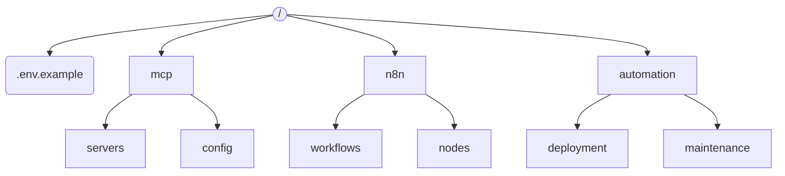

# FTP Release Preparation Plan

## Missing Components Identified
1. **Configuration Template**
   - Missing: `.env.example`
   - Purpose: Base configuration template for new installations
   - Priority: Critical

2. **Model Context Protocol**
   - Missing: `mcp/` directory
   - Purpose: MCP server implementations
   - Priority: Critical

3. **Workflow Automation**
   - Missing: `n8n/` directory
   - Purpose: Workflow definitions and automation scripts
   - Priority: High

4. **Utility Scripts**
   - Missing: `automation/` directory
   - Purpose: Deployment helper scripts
   - Priority: Medium

## Implementation Requirements

### Directory Structure


### Implementation Steps

1. **.env.example**
```php
# Core Configuration
DB_HOST=localhost
DB_NAME=cms
DB_USER=username
DB_PASS=password

# Security
APP_KEY=base64:...
ENCRYPTION_KEY=...

# MCP Settings
MCP_ENABLED=true
MCP_PORT=8080
```

2. **mcp/ Directory**
- Required subdirectories:
  - `servers/` - MCP server implementations
  - `config/` - Server configuration files
- Initial files:
  - `servers/core-server.php` - Core MCP server
  - `config/default.json` - Default server config

3. **n8n/ Directory**
- Workflow structure:
  - `workflows/` - JSON workflow definitions
  - `nodes/` - Custom nodes
- Initial content:
  - Sample deployment workflow
  - CMS integration nodes

4. **automation/ Directory**
- Key scripts:
  - `deployment/ftp-sync.php`
  - `maintenance/cleanup.php`
- Requirements:
  - Must be FTP-executable
  - No CLI dependencies

## Security Considerations
1. All new directories must:
   - Have proper ownership (www-data:www-data)
   - Follow permission guidelines:
     - 755 for directories
     - 644 for files
2. Exclude from web access via `.htaccess`:
```apache
<FilesMatch "\.(json|php)$">
  Deny from all
</FilesMatch>
```

## Timeline
1. Phase 1 (Critical): .env.example + mcp/ - 1 day
2. Phase 2 (High): n8n/ - 2 days
3. Phase 3 (Medium): automation/ - 1 day