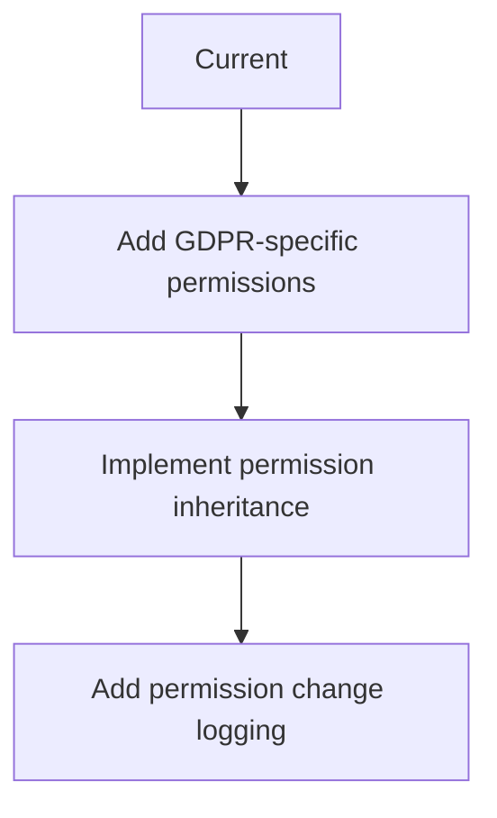
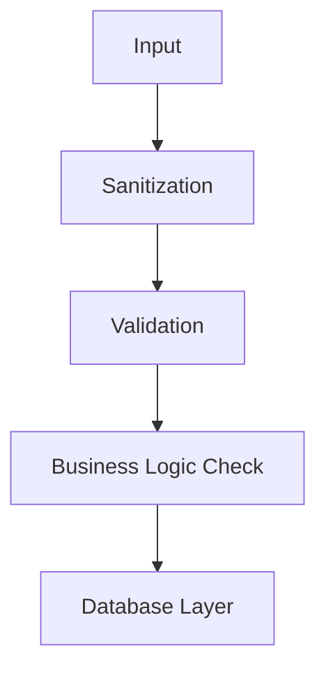

# GDPR Security Enhancement Plan

## 1. Permission System Upgrade

## 2. CSRF Protection Enhancements
- Add token expiration (currently none)
- Implement secondary header verification
- Add per-action token validation

## 3. Data Validation Framework

## 4. Logging Improvements
- Add log file permission checks (0600)
- Implement automatic log cleanup (30 day retention)
- Add log file integrity checks

## 5. UI/UX Security
- Add confirmation dialogs for destructive actions
- Implement progressive disclosure for sensitive operations
- Add visual indicators for irreversible actions

## Implementation Phases
1. Phase 1: Permission enhancements (2 days)
2. Phase 2: CSRF improvements (1 day)
3. Phase 3: Data validation (3 days)
4. Phase 4: Logging improvements (1 day)
5. Phase 5: UI/UX security (2 days)

## Risk Assessment
- High: Data validation framework
- Medium: Permission system changes
- Low: UI/UX improvements