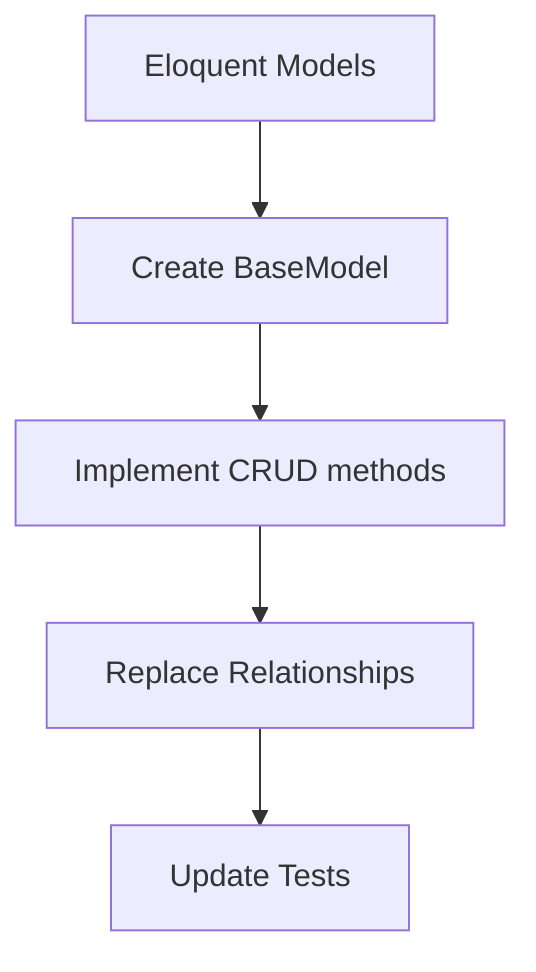

# Laravel Removal Strategy

## 1. Blade Templates Replacement
### Current State:
- Found in `includes/views/auth/passwords/`
- Uses `@extends`, `@section`, `{{ }}` syntax
- Compiled views in `storage/framework/views/`

### Proposed Solution:
- Replace with pure PHP templates using `include`/`require`
- Implement simple template variables system
- Create new directory `includes/views/php/` for refactored templates
- Remove Blade compilation step

```mermaid
graph TD
    A[Blade Templates] --> B[Extract Layout Structure]
    B --> C[Convert to PHP includes]
    C --> D[Replace {{ }} with PHP vars]
    D --> E[Test Auth Flow]
```

## 2. Eloquent ORM Replacement
### Current State:
- Models extend `Illuminate\Database\Eloquent\Model`
- Factories use `Illuminate\Database\Eloquent\Factories\Factory`
- DB facade usage in migrations

### Proposed Solution:
- Create base `Model` class with minimal ORM functionality
- Implement simple query builder
- Replace factories with static creation methods
- Convert migrations to raw SQL files



## 3. Artisan CLI Replacement
### Current State:
- Commands in `app/Console/Commands/`
- Kernel in `app/Console/Kernel.php`
- Scheduled tasks via Artisan

### Proposed Solution:
- Create web-based task runner
- Implement admin panel for scheduled tasks
- Convert commands to web-accessible endpoints
- Remove CLI dependency completely

## Implementation Phases

1. **Phase 1: Template Conversion**
   - Convert auth templates first
   - Verify login/password flows
   - Remove Blade compiler

2. **Phase 2: Database Layer**
   - Implement BaseModel
   - Refactor critical models
   - Update tests

3. **Phase 3: Task System**
   - Build web task interface
   - Migrate scheduled jobs
   - Remove Artisan

## Risks & Mitigation
- **Risk**: Broken auth flows
  - Mitigation: Thorough testing after each template conversion
- **Risk**: Performance degradation
  - Mitigation: Benchmark new ORM implementation
- **Risk**: Lost CLI functionality
  - Mitigation: Build equivalent web interfaces