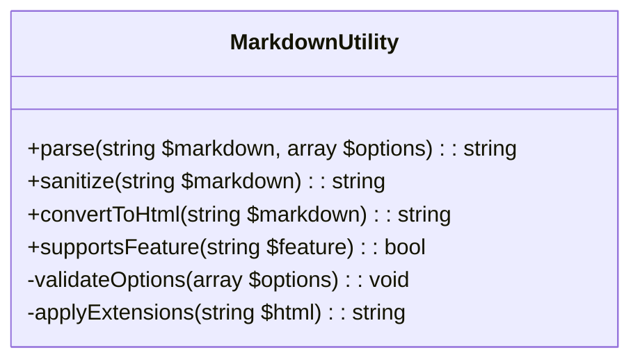

# Markdown Rendering Improvement Plan

## Current State Analysis
- Basic markdown parsing exists in multiple locations
- No standardized utility class
- Minimal security features
- Inconsistent feature support

## Proposed Improvements

### 1. Centralized MarkdownUtility Class
Location: `includes/utilities/MarkdownUtility.php`

Features:

### 2. Enhanced Feature Support
- CommonMark/GitHub Flavored Markdown support
- Tables, task lists, footnotes
- Syntax highlighting
- Custom extensions system

### 3. Security Enhancements
- HTML sanitization
- XSS protection
- Link validation
- Safe mode by default

## Implementation Strategy

### Phase 1: Core Utility (1 week)
1. Create `MarkdownUtility` class
2. Implement basic parsing with security
3. Add test cases

### Phase 2: Integration (2 days)
1. Update existing implementations to use utility
2. Deprecate old methods
3. Verify backward compatibility

### Phase 3: Feature Expansion (1 week)
1. Add extended syntax support
2. Implement caching
3. Add plugin system

## Migration Path
1. Mark old methods as `@deprecated`
2. Provide wrapper functions during transition
3. Full removal in next major version

## Backward Compatibility
- Maintain old method signatures
- Add compatibility layer
- Log deprecation warnings