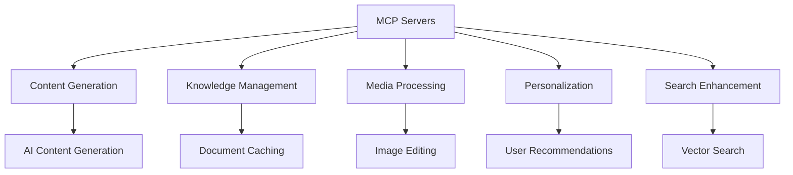

# MCP Server Optimization Plan

## 1. Resource Mapping to CMS Needs

| MCP Server | CMS Need | Integration Point |
|------------|----------|-------------------|
| dalle-mcp | Media Processing | Image generation/editing for content |
| cms-knowledge-server | Knowledge Management | File caching for documentation |
| context7-mcp | Content Generation | API documentation lookup |
| sequentialthinking | Personalization | Complex decision making |
| core-mcp-server | System Monitoring | AWS resource management |

## 2. Mode Usage Guidelines

| Mode | Primary MCP Resources | Usage Rules |
|------|-----------------------|-------------|
| Code | context7-mcp, dalle-mcp | Use for API docs and image generation |
| Architect | core-mcp-server | Use for infrastructure planning |
| Debug | sequentialthinking | Use for complex problem solving |
| DB Support | cms-knowledge-server | Use for schema/document caching |

## 3. Monitoring Implementation

1. **Metrics Collection**:
   - Response times per MCP call
   - Error rates per server
   - Concurrent connections

2. **Alerting**:
   - Priority-based alerts
   - Real-time logging to memory-bank

3. **Dashboard**:
   - Grafana integration
   - Key metrics visualization

## 4. Automatic Scaling

1. **Horizontal Scaling**:
   - Multiple instances of stateless MCP servers
   - Load balancer configuration

2. **Vertical Scaling**:
   - Memory/CPU adjustments based on:
     - Request queue length
     - Response time percentiles

3. **Fallback**:
   - Circuit breakers for failed servers
   - Graceful degradation

## 5. Documentation Strategy

1. **Integration Points**:
   - API contracts
   - Error handling
   - Authentication

2. **Location**:
   - `/docs/mcp-integration.md`
   - Auto-generated from configs

## 6. Fallback Mechanisms

1. **Primary Fallbacks**:
   - Local cached responses
   - Simplified workflows
   - Queue-and-retry pattern

2. **Monitoring**:
   - Track fallback usage
   - Alert on frequent fallbacks