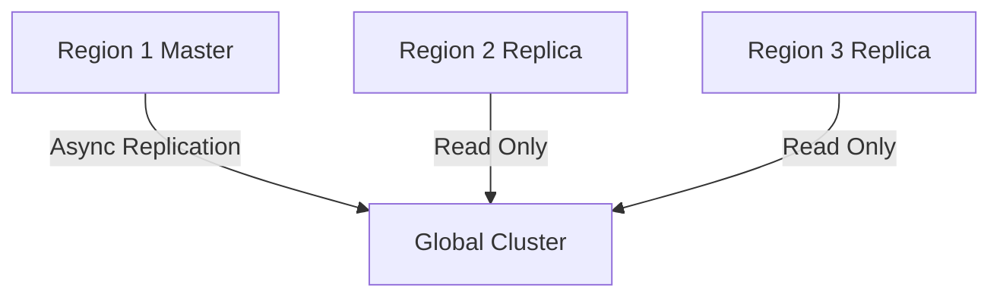

# Multi-Region Deployment Architecture

## Database Replication

## Content Synchronization
- Push-pull hybrid model
- Version tracking with content hashes
- Differential sync for large files

## Failover Procedures
1. Health monitoring (every 30s)
2. Automatic DNS failover
3. Cache invalidation
4. Regional promotion

## Implementation Phases
| Phase | Tasks | Duration |
|-------|-------|----------|
| 1 | Database setup | 2 weeks |
| 2 | Sync service | 3 weeks |
| 3 | Failover automation | 1 week |
| 4 | Optimization | 2 weeks |

## Security Requirements
- Tenant isolation during replication
- TLS 1.3 for inter-region traffic
- Regional permission validation