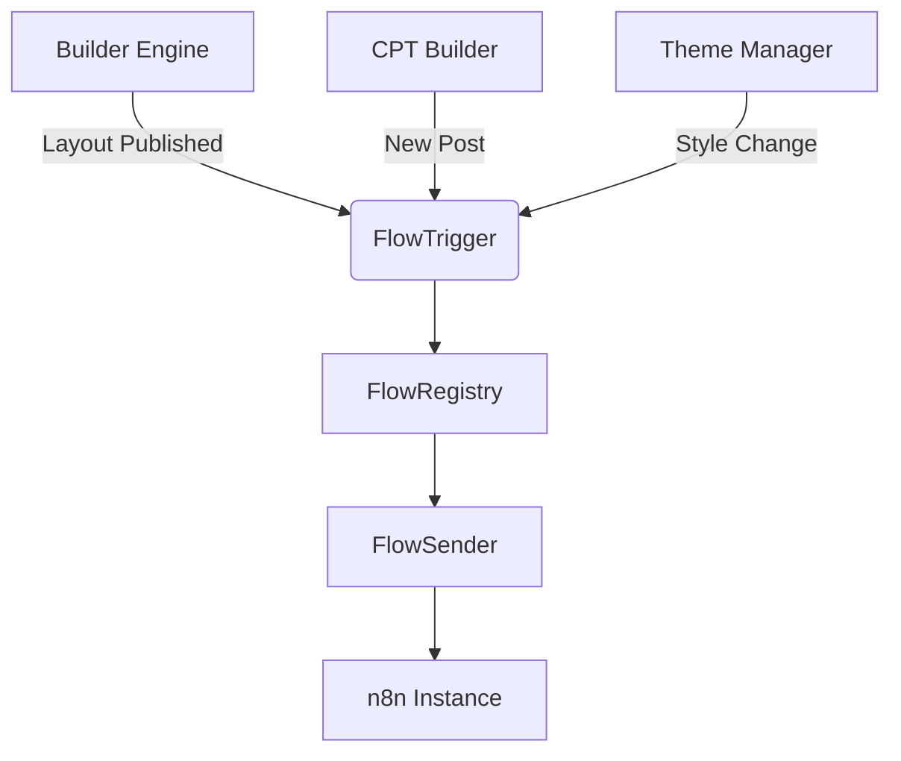

# n8n Flow Generator Module Plan

## 1. Module Structure
```
modules/FlowGenerator/
├── FlowRegistry.php       # Workflow storage/management
├── FlowTrigger.php        # Event dispatcher
├── FlowSender.php         # HTTP communication
├── bootstrap.php          # Module initialization
└── schemas/               # JSON schema examples
```

## 2. Core Components
### FlowRegistry
- Stores workflow definitions (JSON)
- Manages workflow-state relationships
- Provides validation against schema

### FlowTrigger
- Listens to CMS events
- Matches events to registered workflows
- Prepares context data

### FlowSender
- Handles HTTP POST to n8n
- Implements retry logic
- Processes responses

## 3. Integration Points


## 4. Example JSON Schema
```json
{
  "workflow_id": "theme-update-notify",
  "trigger_event": "theme_updated",
  "n8n_webhook": "https://n8n.example.com/webhook/abc123",
  "payload_template": {
    "theme": "{{theme_name}}",
    "changed_at": "{{timestamp}}",
    "changed_by": "{{user_email}}"
  }
}
```

## 5. Phase Plan
### MVP (1 week)
- Basic registry and sender
- CPT/Build Engine triggers
- Simple error handling

### Core (2 weeks)
- All trigger types
- Advanced payload templating
- Response processing

### Optional
- UI for workflow management
- n8n credential management
- Workflow testing interface

## 6. Risks & Mitigation
- **Timeouts**: Implement async queue
- **Invalid Payloads**: Schema validation
- **n8n Downtime**: Circuit breaker pattern
- **Security**: Input sanitization