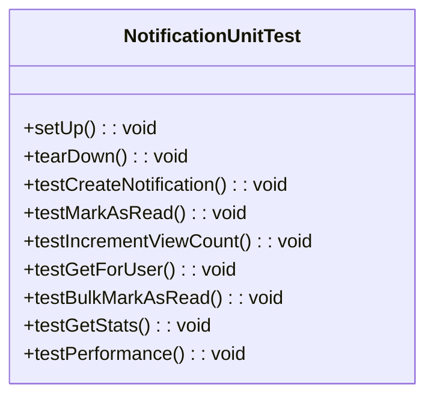

# Notification Model Unit Test Plan

## Test Structure

## Test Cases

### 1. testCreateNotification()
- Verify successful notification creation
- Test required field validation
- Test invalid data handling

### 2. testMarkAsRead()
- Verify read status update
- Test timestamp recording
- Test invalid ID handling

### 3. testIncrementViewCount()
- Verify counter increment
- Test concurrent increments
- Test invalid ID handling

### 4. testGetForUser()
- Test filtering by:
  - Read/unread status
  - Notification type
  - Date ranges
- Test pagination
- Test sorting

### 5. testBulkMarkAsRead()
- Verify batch update
- Test empty/invalid ID lists
- Test performance with large datasets

### 6. testGetStats()
- Verify counts by type
- Test date range filtering
- Test empty result handling

### 7. testPerformance()
- Benchmark with 100+ notifications
- Measure query execution time
- Verify <500ms response time

## Implementation Approach

### Mocking Strategy
- Create PDO mock class
- Mock database connection
- Prepare expected query results

### Test Data
- Manual array-based test data
- No factories/database seeding
- Isolated test cases

### Assertions
- Verify SQL queries
- Check returned data structure
- Validate state changes

### Error Testing
- Invalid database connections
- Missing required fields
- Invalid input data

## Compliance Checklist
- [ ] No Laravel dependencies
- [ ] Pure PHPUnit implementation
- [ ] Manual PDO mocking
- [ ] Shared hosting compatible
- [ ] Documented in decisionLog.md