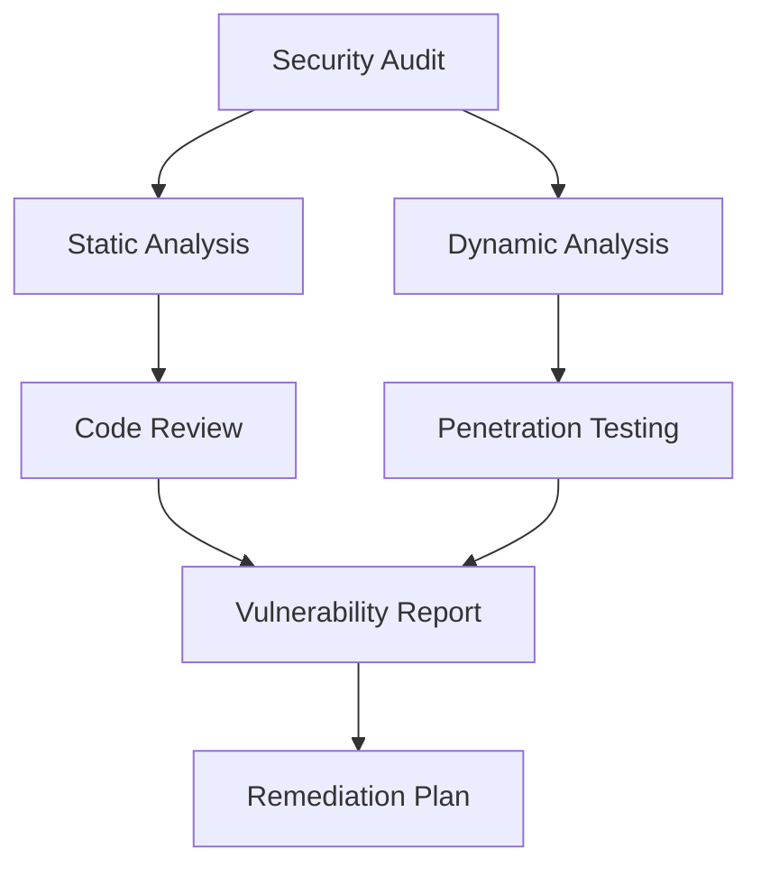
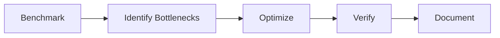

# Phase 10 Final Implementation Plan

## 1. Security Hardening

**Tasks:**
- Extend `config/security-standards.md`
- Create `SecurityAuditor` class
- Implement `SecurityDashboard` in admin panel
- Add scheduled security scans via n8n workflows

**Mode:** Debug

## 2. Performance Optimization

**Tasks:**
- Extend `config/performance.php`
- Create `PerformanceBenchmarker` service
- Implement query optimization advisor
- Document caching strategies

**Mode:** Code

## 3. Deployment Automation
**Tasks:**
- Create `DeploymentManager` class
- Implement incremental file sync
- Add rollback capability
- Develop one-click deployment UI

**Mode:** Service Integrator

## 4. Monitoring Dashboard
**Tasks:**
- Realtime performance metrics
- Security alerts
- Content changes audit log
- System health indicators

**Mode:** Code

## 5. Documentation Generator
**Tasks:**
- API documentation from code comments
- System architecture diagrams
- Automated changelog generation
- Plugin/theme documentation templates

**Mode:** Documents

## Implementation Order:
1. Security audit system
2. Performance framework
3. Monitoring dashboard
4. Deployment tools
5. Documentation generator

## Architectural Decisions:
1. Maintain framework-free PHP implementation
2. Use REST API for all service communication
3. Follow existing memory bank protocols
4. Build upon completed Phase 9 components