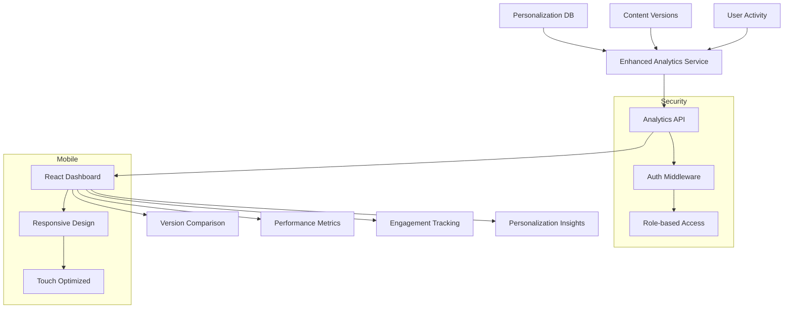

# Phase 10 Analytics Implementation Plan

## Overview
Enhanced analytics dashboard focusing on:
- Real-time version comparison metrics
- Content performance visualization
- User engagement tracking
- Personalization database integration

## Architecture Diagram


## Database Schema Changes
1. New tables:
   - `content_performance_enhanced` (detailed engagement metrics)
   - `user_engagement_metrics` (aggregated user behavior)
   - `dashboard_preferences` (user-specific dashboard configs)

2. Enhance existing tables:
   - Add `time_on_page` to `version_analytics`
   - Add `scroll_depth` to `analytics_events`
   - Add `device_type` to `recommendation_analytics`

## Directory Structure
```
analytics/
├── services/
│   ├── AnalyticsService.php
│   ├── VersionComparator.php
│   └── EngagementTracker.php
├── api/
│   ├── AnalyticsController.php
│   └── routes.php
├── dashboard/
│   ├── assets/
│   ├── components/
│   └── index.php
└── migrations/
    ├── 20250606_000000_create_enhanced_analytics_tables.php
    └── 20250606_010000_update_existing_analytics_tables.php
```

## Implementation Phases
1. **Backend Foundation (2 weeks)**
   - Create database tables
   - Build analytics service
   - Implement API endpoints

2. **Frontend Development (3 weeks)**
   - Build React components
   - Implement visualizations
   - Mobile responsiveness

3. **Integration & Testing (1 week)**
   - Connect to personalization DB
   - Performance testing
   - Security review

4. **Deployment (1 week)**
   - Staging testing
   - Gradual rollout
   - Monitoring setup