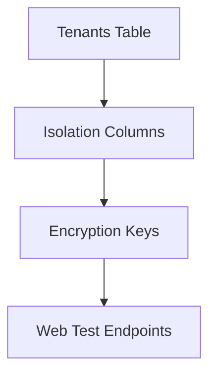
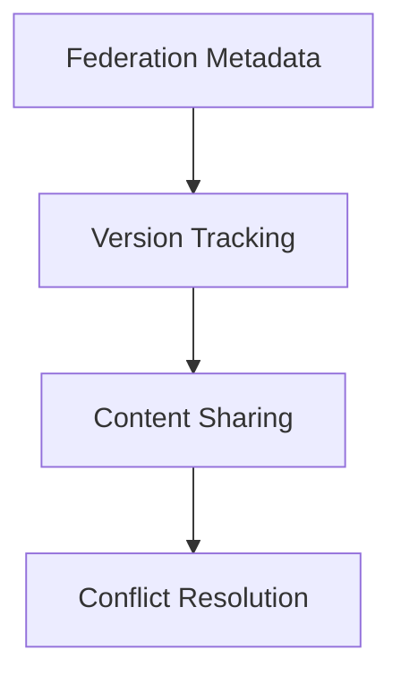
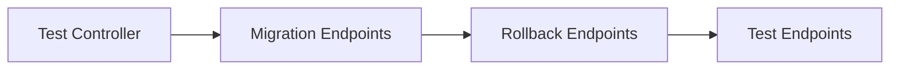

# Phase 10 Database Migration Plan

## 1. Tenants Table Migration


### Schema Design
```sql
CREATE TABLE tenants (
    id INT AUTO_INCREMENT PRIMARY KEY,
    name VARCHAR(255) NOT NULL,
    domain VARCHAR(255) UNIQUE NOT NULL,
    is_active BOOLEAN DEFAULT TRUE,
    created_at TIMESTAMP DEFAULT CURRENT_TIMESTAMP,
    updated_at TIMESTAMP DEFAULT CURRENT_TIMESTAMP ON UPDATE CURRENT_TIMESTAMP,
    isolation_key VARCHAR(255) NOT NULL COMMENT 'Encryption key for tenant data isolation'
);
```

### Implementation Steps
1. Create migration file: `database/migrations/2025_phase10_tenants.php`
2. Implement static methods:
   - `migrate()` - Creates table with isolation columns
   - `rollback()` - Drops tenants table
   - `test()` - Verifies migration and rollback
3. Create web endpoints:
   - `/migrate/tenants`
   - `/rollback/tenants`
   - `/test/tenants`

## 2. Federation Metadata Table


### Schema Design
```sql
CREATE TABLE federation_metadata (
    id INT AUTO_INCREMENT PRIMARY KEY,
    federation_id VARCHAR(255) UNIQUE NOT NULL,
    entity_id VARCHAR(255) NOT NULL,
    metadata JSON NOT NULL,
    version VARCHAR(50) NOT NULL,
    is_active BOOLEAN DEFAULT TRUE,
    created_at TIMESTAMP DEFAULT CURRENT_TIMESTAMP,
    updated_at TIMESTAMP DEFAULT CURRENT_TIMESTAMP ON UPDATE CURRENT_TIMESTAMP,
    INDEX (entity_id)
);
```

### Implementation Steps
1. Create migration file: `database/migrations/2025_phase10_federation_metadata.php`
2. Implement static methods:
   - `migrate()` - Creates federation metadata table
   - `rollback()` - Drops table
   - `test()` - Verifies operations
3. Create web endpoints:
   - `/migrate/federation_metadata`
   - `/rollback/federation_metadata`
   - `/test/federation_metadata`

## 3. Web-Accessible Test Endpoints


### Implementation Details
1. Extend existing test endpoint system
2. Add new routes:
   ```php
   $router->post('/phase10/migrate/tenants', 'Phase10TestController@migrateTenants');
   $router->post('/phase10/rollback/tenants', 'Phase10TestController@rollbackTenants');
   $router->post('/phase10/test/tenants', 'Phase10TestController@testTenants');
   ```
3. Implement JSON response format:
   ```json
   {
       "status": "success|error",
       "message": "Operation details",
       "data": {}
   }
   ```

## Compliance Verification
- Framework-free PHP 8.1+
- FTP-deployable structure
- Shared hosting compatible
- Follows migration standards from `memory-bank/db_migration_rules.md`