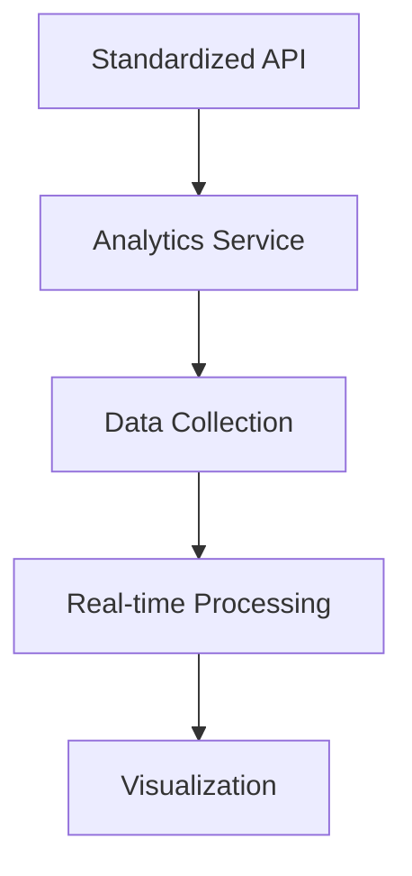

# Phase 10 Development Plan

## 1. Analytics Dashboard Integration


### Implementation:
- Create `/api/analytics` endpoints following API standards
- Implement tenant-aware metrics collection
- Build dashboard using existing JS framework
- Add caching layer for performance

### Timeline: 3 weeks

## 2. Performance Optimization
### Key Areas:
- API response caching
- Database query optimization
- Batch processing for analytics
- Asset delivery optimization

### Actions:
- Implement Redis caching for frequent queries
- Add query profiling endpoints
- Optimize content federation sync process
- Review rate limiting thresholds

### Timeline: 2 weeks

## 3. Scalability Improvements
### Architecture Updates:
- Horizontal scaling for API services
- Database sharding by tenant
- Async processing for heavy operations
- Queue-based workload distribution

### Implementation:
- Migrate to tenant-aware query builder
- Implement bulk operation queue
- Add auto-scaling triggers
- Enhance monitoring

### Timeline: 4 weeks

## 4. Documentation Updates
### Required Updates:
- API standards documentation
- Analytics endpoint reference
- Performance tuning guide
- Scalability architecture

### Deliverables:
- Update `memory-bank/api_standards.md`
- Create `docs/analytics-api.md`
- Add `docs/performance-guide.md`
- Document scaling patterns

### Timeline: 1 week

## 5. Testing Procedures
### Test Strategy:
- Unit tests for new analytics endpoints
- Load testing for scalability
- Performance benchmarking
- Tenant isolation validation

### Implementation:
- Add test cases for analytics API
- Create load test scripts
- Implement continuous performance monitoring
- Verify cross-tenant data isolation

### Timeline: 2 weeks

## Overall Timeline
```mermaid
gantt
    title Phase 10 Development Timeline
    dateFormat  YYYY-MM-DD
    section Core Work
    Analytics Integration      :a1, 2025-06-10, 21d
    Performance Optimization   :a2, after a1, 14d
    Scalability Improvements   :a3, after a1, 28d
    section Supporting
    Documentation Updates      :a4, 2025-06-17, 7d
    Testing Procedures         :a5, after a2, 14d