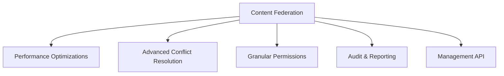
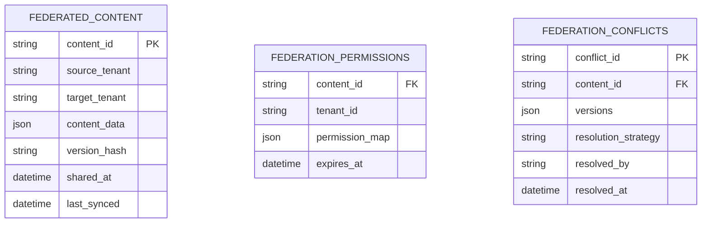

# Phase10 Content Federation Enhancement Plan

## 1. Core Enhancements


## 2. Technical Specifications

### Performance Optimizations
- Implement batch processing for large content sets
- Add caching layer for federation metadata
- Optimize database queries with tenant-aware indexing

### Advanced Conflict Resolution
- Add semantic diff capabilities
- Implement merge strategies:
  ```php
  $strategies = [
      'semantic' => 'Content-aware merging',
      'sectional' => 'Per-section resolution',
      'hybrid' => 'Auto-merge with manual override'
  ];
  ```

### Granular Permissions
- Field-level permission controls
- Inheritable permission templates
- Time-bound access restrictions

## 3. Database Schema Changes


## 4. API Endpoints
| Endpoint | Method | Description |
|----------|--------|-------------|
| `/api/federation/share` | POST | Share content with target tenants |
| `/api/federation/sync` | POST | Synchronize content versions |
| `/api/federation/conflicts` | GET | List unresolved conflicts |
| `/api/federation/resolve` | POST | Resolve content conflicts |
| `/api/federation/audit` | GET | Get federation audit logs |

## 5. Implementation Milestones

1. **Week 1**: Database schema updates and migration scripts
2. **Week 2**: Core federation engine enhancements
3. **Week 3**: API endpoint implementation
4. **Week 4**: Testing and performance tuning
5. **Week 5**: Documentation and deployment

## 6. Testing Strategy
- Unit tests for all new federation methods
- Integration tests for API endpoints
- Performance tests with large content sets
- Permission validation tests

## 7. Deployment Considerations
- Zero-downtime migration
- Backward compatibility with existing federation
- Rollback procedures
- Monitoring integration