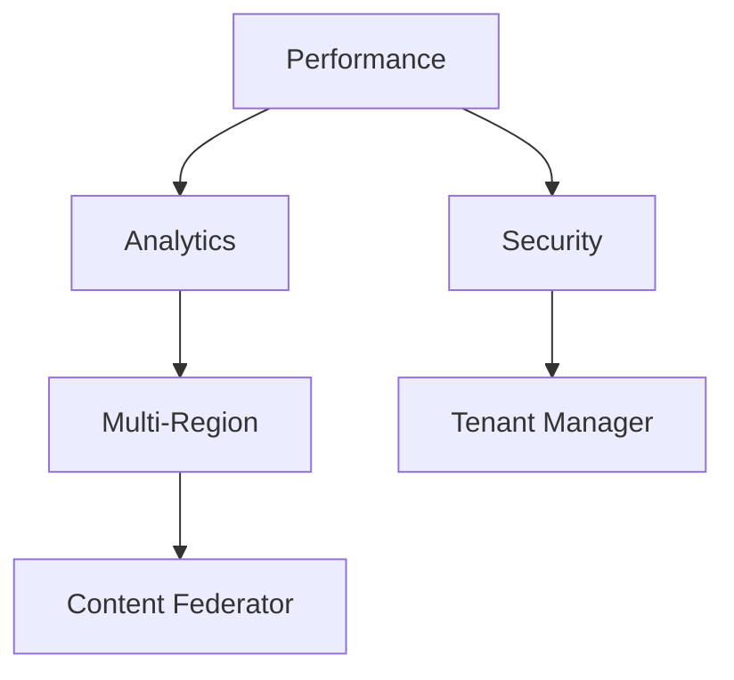

# Phase 11 Architecture Plan

## Components
1. **Performance Optimization Module**
   - Cache tiering (global/tenant/content levels)
   - Query optimization with explain plan analysis
   - Smart asset delivery (WebP generation, CDN routing)

2. **Advanced Analytics Dashboard**  
   - Lightweight tracker (1KB payload)
   - Tenant-isolated data storage
   - SVG-based visualization engine

3. **Automated Scaling System**
   - Triggers: Response time, users, resources
   - Actions: Read replicas, cache expansion, workers

4. **Enhanced Security Layer**
   - Request fingerprinting
   - Behavioral analysis
   - Tenant isolation verification

5. **Multi-Region Deployment**
   - Content version synchronization
   - GeoDNS routing
   - Conflict resolution protocol

## Integration Points

## Implementation Sequence
1. Performance baseline (2 weeks)
2. Analytics collection (1 week)
3. Security integration (2 weeks)  
4. Scaling triggers (1 week)
5. Multi-region deployment (3 weeks)

## Constraints
- PHP 8.1+ only
- No CLI dependencies
- FTP-deployable components
- Shared hosting compatible