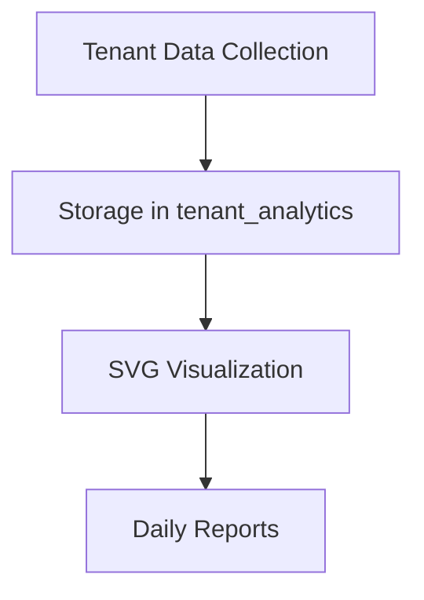
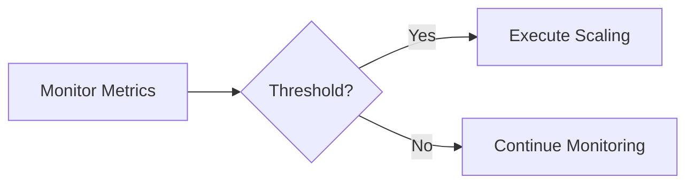

# Phase 11 Detailed Implementation Plan

## 1. Component Breakdown

### 1.1 Advanced Analytics Dashboard

**Tasks**:
1. Create `AnalyticsCollector` class (code mode)
2. Implement tenant_analytics migration (db-support mode)
3. Build SVG renderer (code mode)
4. Configure n8n report workflow (orchestrator mode)

**Dependencies**: Phase10 tenants table

### 1.2 Automated Scaling System

**Tasks**:
1. Extend `PerformanceBenchmarker` (code mode)
2. Create scaling triggers config (code mode)
3. Implement scaling actions (code mode)
4. Add graceful degradation (code mode)

**Dependencies**: Phase9 performance framework

### 1.3 Security Layer Integration
**Tasks**:
1. Extend `SecurityAuditor` (code mode)
2. Implement behavioral analysis (code mode)
3. Add tenant isolation checks (code mode)
4. Create security dashboard (code mode)

**Dependencies**: Phase9 security system

### 1.4 Multi-Region Deployment
**Tasks**:
1. Create sync protocol (code mode)
2. Implement GeoDNS routing (orchestrator mode)
3. Build conflict resolution (code mode)
4. Add region fallback (code mode)

**Dependencies**: Phase10 federation metadata

## 2. Implementation Timeline

| Week | Focus Area | Mode Required |
|------|------------|---------------|
| 1-2  | Analytics  | code, db-support |
| 3    | Scaling    | code          |
| 4    | Security   | code          |
| 5-6  | Multi-Region | code, orchestrator |

## 3. Transition Report Structure
1. Phase completion status
2. Test results summary
3. Outstanding issues
4. Resource utilization
5. Phase12 recommendations