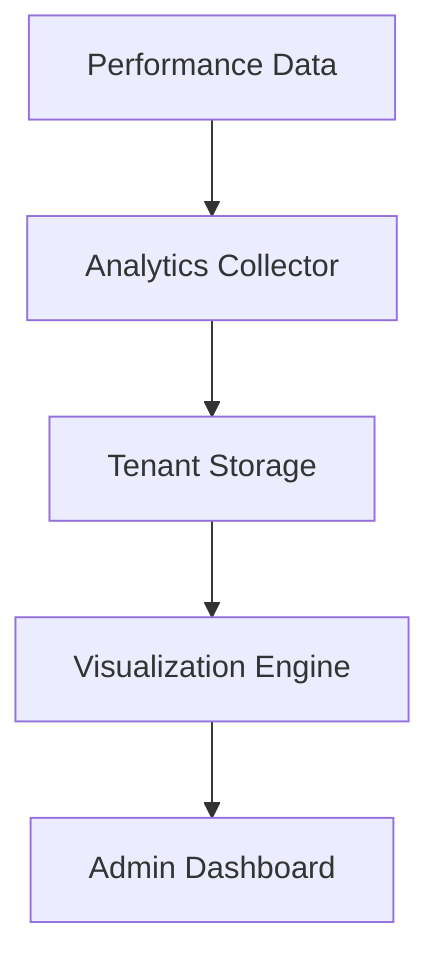
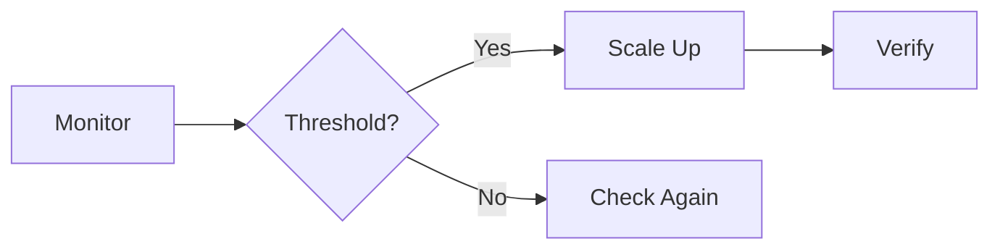
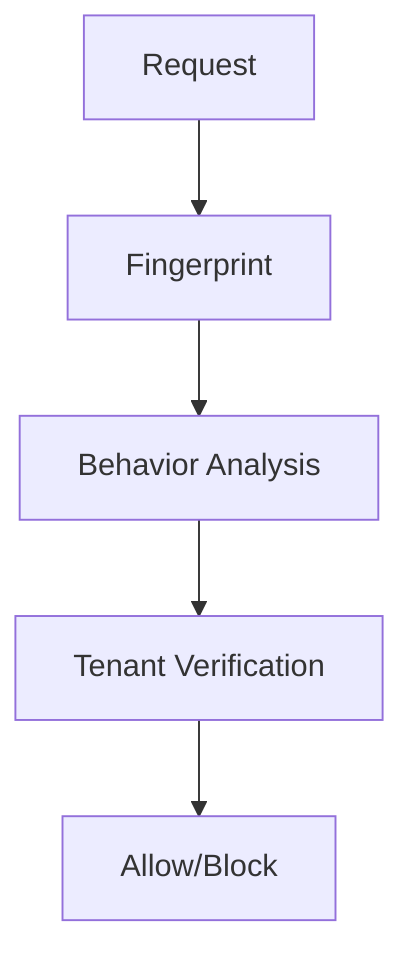
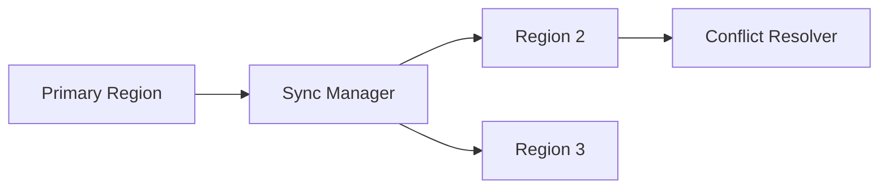

# Phase 11 Detailed Architecture Plan

## 1. Advanced Analytics Dashboard

**Implementation:**
- Lightweight tracker (1KB payload max)
- Tenant-isolated JSON storage
- SVG-based visualizations (no JavaScript)
- Integration with PerformanceModule metrics
- Daily summary reports via n8n

## 2. Automated Scaling System

**Triggers:**
- Response time >500ms
- CPU >80% for 5min
- Memory >90% for 5min

**Actions:**
- Enable read replicas
- Expand cache tier
- Add worker processes
- Fallback to graceful degradation

## 3. Security Layer Integration

**Components:**
- Request fingerprinting (headers/IP/patterns)
- Behavioral anomaly detection
- Tenant isolation checks
- Integration with SecurityAuditor

## 4. Multi-Region Deployment

**Protocol:**
- Content version synchronization
- GeoDNS-based routing
- Conflict resolution (last-write-wins)
- Fallback to primary region

## Implementation Sequence
1. Analytics Collector (Week 1-2)
2. Scaling Triggers (Week 3)
3. Security Integration (Week 4)
4. Multi-Region Sync (Week 5-6)