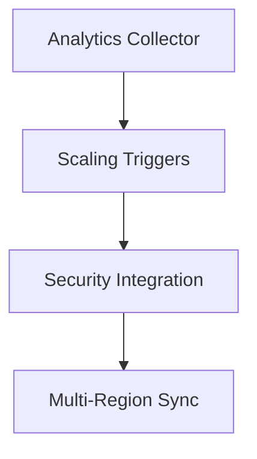

# Phase 11 Implementation Plan

## 1. Implementation Sequence


## 2. Component Implementation

### 2.1 Advanced Analytics Dashboard
**Technical Requirements:**
- Lightweight tracker (1KB payload max)
- Tenant-isolated JSON storage
- SVG-based visualizations
- Daily summary reports via n8n

**Database Changes:**
```sql
CREATE TABLE tenant_analytics (
    id INT AUTO_INCREMENT PRIMARY KEY,
    tenant_id INT NOT NULL,
    metric_name VARCHAR(50) NOT NULL,
    metric_value JSON NOT NULL,
    created_at TIMESTAMP DEFAULT CURRENT_TIMESTAMP,
    FOREIGN KEY (tenant_id) REFERENCES tenants(id)
);
```

### 2.2 Automated Scaling System
**Triggers:**
- Response time >500ms
- CPU >80% for 5min
- Memory >90% for 5min

**Actions:**
1. Enable read replicas
2. Expand cache tier
3. Add worker processes
4. Fallback to graceful degradation

### 2.3 Security Layer Integration
**Components:**
- Request fingerprinting (headers/IP/patterns)
- Behavioral anomaly detection
- Tenant isolation checks
- SecurityAuditor integration

### 2.4 Multi-Region Deployment
**Protocol:**
- Content version synchronization
- GeoDNS-based routing
- Conflict resolution (last-write-wins)
- Fallback to primary region

## 3. Testing Strategy

### 3.1 Test Cases
| Component | Test Scenario | Success Criteria |
|-----------|---------------|------------------|
| Analytics | Data collection | 200 status, correct metrics |
| Scaling | Trigger conditions | Proper scaling actions |
| Security | Malicious requests | Proper blocking |
| Multi-Region | Sync conflicts | Correct resolution |

### 3.2 Test Data
```json
{
  "analytics": {
    "valid": {"page_views": 150, "load_time": 420},
    "invalid": {"page_views": "abc", "load_time": -1}
  },
  "scaling": {
    "high_cpu": {"duration": 300, "value": 85},
    "normal": {"duration": 300, "value": 70}
  }
}
```

## 4. Deployment Plan

### 4.1 Migration Requirements
- Static methods only
- Web-accessible endpoints
- Foreign key standards
- Rollback procedures

### 4.2 Deployment Checklist
1. Verify multisite configuration
2. Execute migrations in sequence
3. Test all API endpoints
4. Verify tenant context

## 5. Timeline
- Week 1-2: Analytics Collector
- Week 3: Scaling Triggers
- Week 4: Security Integration
- Week 5-6: Multi-Region Sync