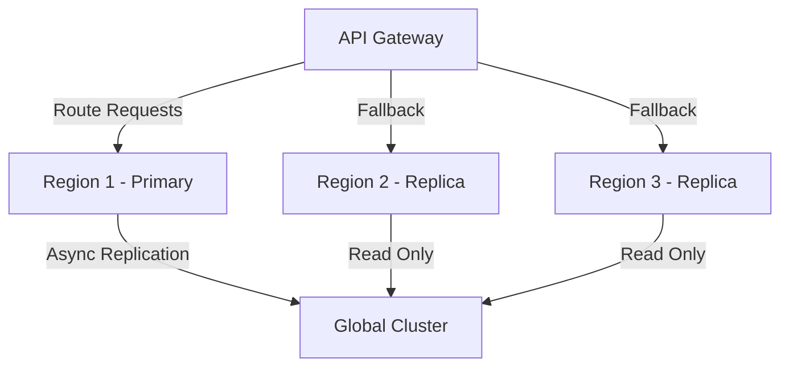

# Phase 11 Implementation Plan

## 1. Multi-Region Deployment Architecture

**Implementation Steps:**
1. Deploy database replicas in each region (2 weeks)
2. Configure async replication with conflict resolution (1 week)
3. Implement regional health monitoring (1 week)
4. Set up automatic DNS failover (1 week)

## 2. Content Federation Strategy

**Approach:**
- Push-pull hybrid model with version tracking
- Differential sync for large files
- Regional caching with invalidation

**Implementation:**
1. Extend site_content_sharing table for regional permissions (1 week)
2. Build content sync service (3 weeks)
3. Implement version conflict resolution (2 weeks)

## 3. Database Sharding Requirements

**Sharding Strategy:**
- Horizontal sharding by tenant_id
- Regional shard placement based on tenant location
- Cross-shard queries via API gateway

**Implementation:**
1. Modify migrations for shard-aware schema (2 weeks)
2. Build shard routing layer (3 weeks)
3. Implement cross-shard query handling (2 weeks)

## 4. API Gateway Enhancements

**New Features:**
1. Regional request routing
2. Shard-aware request forwarding
3. Circuit breakers for regional failover
4. Content federation endpoints

**Implementation Timeline:**
- Router modifications (2 weeks)
- Middleware additions (1 week)
- Testing and optimization (1 week)

## 5. Performance Optimization Roadmap

1. **Q3 2025**: Regional caching implementation
2. **Q4 2025**: Query optimization for sharded data
3. **Q1 2026**: Content delivery network integration
4. **Q2 2026**: Global load balancing

## Security Considerations

- TLS 1.3 for all inter-region traffic
- Regional permission validation
- Tenant isolation during replication
- Encrypted content synchronization