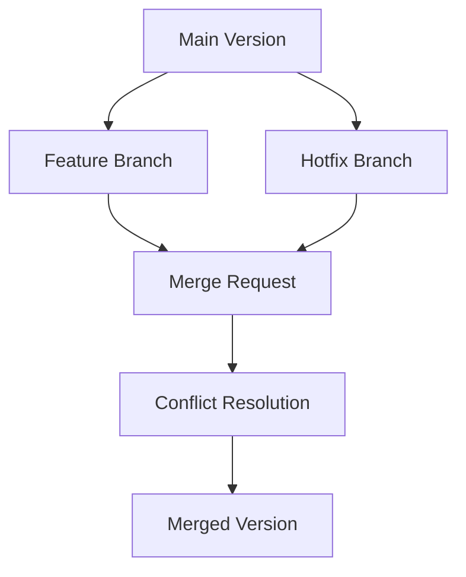

# Phase 11 Technical Specifications: Content Versioning & Conflict Resolution

## 1. Database Schema Changes
```sql
-- New tables for conflict tracking
CREATE TABLE content_conflicts (
  id VARCHAR(36) PRIMARY KEY,
  content_id VARCHAR(36) NOT NULL,
  current_version VARCHAR(24) NOT NULL,
  pending_version VARCHAR(24) NOT NULL,
  status ENUM('pending','resolved') DEFAULT 'pending',
  created_at DATETIME DEFAULT CURRENT_TIMESTAMP,
  resolved_at DATETIME NULL,
  INDEX (content_id),
  INDEX (status)
);

CREATE TABLE conflict_resolutions (
  id VARCHAR(36) PRIMARY KEY,
  conflict_id VARCHAR(36) NOT NULL,
  action ENUM('approve','reject','merge') NOT NULL,
  resolved_by VARCHAR(36) NOT NULL,
  notes TEXT NULL,
  created_at DATETIME DEFAULT CURRENT_TIMESTAMP,
  FOREIGN KEY (conflict_id) REFERENCES content_conflicts(id)
);
```

## 2. Version Control System Enhancements

### Version Branching


### Conflict Detection Workflow
1. Real-time monitoring via ContentLock system
2. Conflict detection using ConflictResolutionService
3. Three resolution strategies:
   - Approve pending version
   - Reject pending version
   - Manual merge

## 3. API Contracts

| Endpoint | Method | Parameters | Response |
|----------|--------|------------|----------|
| `/api/v1/versions/conflicts/detect` | POST | content_id, version_a, version_b | {has_conflicts: bool, diff: array} |
| `/api/v1/versions/conflicts` | GET | content_id | Array<Conflict> |
| `/api/v1/versions/conflicts/{id}/resolve` | POST | resolution_strategy, resolved_by | {success: bool} |
| `/api/v1/versions/branches` | POST | content_id, base_version, branch_name | {branch_id: string} |
| `/api/v1/versions/branches/{id}/merge` | POST | resolution_strategy | {merged_version: string} |

## 4. Performance Optimizations
- Chunked content processing (max 10KB chunks)
- Background diff calculations via n8n workflows
- Redis caching for frequent version comparisons
- Database indexing on version metadata

## 5. UI Requirements
1. Visual Merge Tool:
   - Side-by-side diff view
   - Inline conflict markers
   - Three-way merge capability

2. Conflict Resolution Dashboard:
   - Filter by content type/status
   - Assign resolution owners
   - Resolution history tracking

3. Version Branch Graph:
   - Interactive D3.js visualization
   - Branch creation/merge actions

## 6. Implementation Phases

| Week | Tasks | Owner |
|------|-------|-------|
| 1 | Database migrations | db-support |
| 2 | Conflict detection service | code |
| 3 | API endpoints | code |
| 4 | Version branching | code |
| 5 | UI enhancements | code |
| 6 | Testing & optimization | debug |

## 7. Testing Strategy
1. Concurrent editing scenarios
2. Large content performance tests
3. Conflict resolution workflows
4. Branch merge validation
5. Rollback procedures