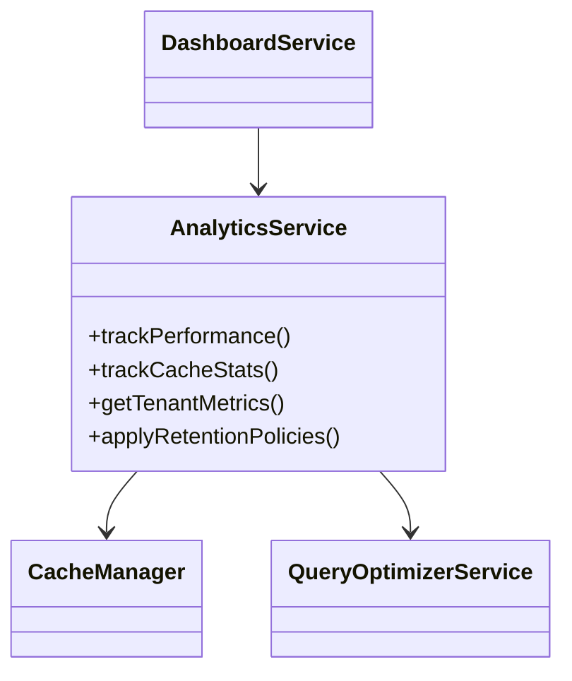

# Phase 12 Analytics Implementation Plan

## 1. Service Architecture


## 2. Database Schema
```mermaid
erDiagram
    ANALYTICS_METRICS {
        int id PK
        datetime timestamp
        varchar metric_name
        float value
        varchar tenant_id NULL
    }
    CACHE_STATS {
        int id PK
        datetime timestamp
        int hits
        int misses
        int size_kb
    }
```

## 3. Implementation Steps

### 3.1 Core Services
1. Create `services/AnalyticsService.php` with:
   - Performance tracking
   - Cache monitoring
   - Tenant analytics
   - Token management integration

2. Modify existing services:
   - Add stats collection to `CacheManager`
   - Extend `QueryOptimizerService` metrics
   - Update `DashboardService` widgets

### 3.2 Database Migration
```php
// database/migrations/Migration_<?php echo date('YmdHis'); ?>_CreateAnalyticsTables.php
class Migration_CreateAnalyticsTables {
    public static function up() {
        // Implementation details...
    }
    
    public static function down() {
        // Rollback logic...
    }
}
```

### 3.3 Token Management
1. Implement chunking for large reports
2. Add emergency procedures
3. Monitor token usage in analytics

## 4. Testing Strategy
1. Tenant isolation verification
2. Performance impact monitoring
3. Token management validation
4. Web-accessible test endpoints