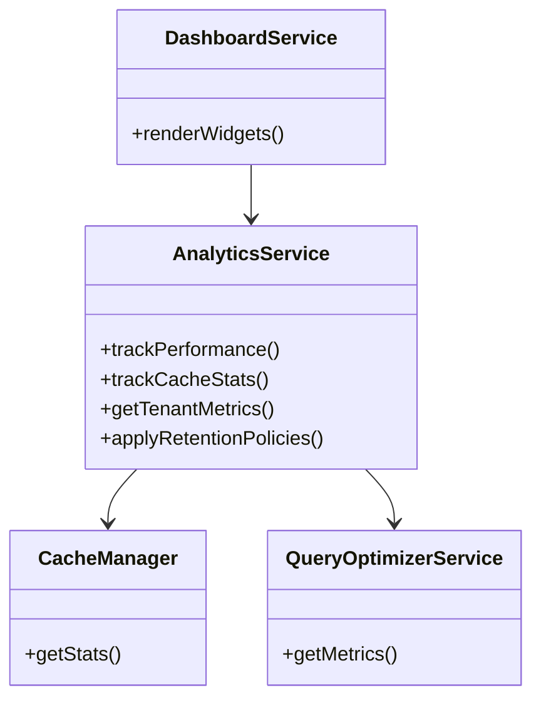

# Phase 12 Analytics Technical Specifications

## 1. System Architecture


## 2. Database Schema
```mermaid
erDiagram
    ANALYTICS_METRICS {
        int id PK
        datetime timestamp
        varchar metric_name
        float value
        varchar tenant_id NULL
    }
    CACHE_STATS {
        int id PK
        datetime timestamp
        int hits
        int misses
        int size_kb
    }
    PERFORMANCE_METRICS {
        int id PK
        datetime timestamp
        float response_time
        float db_query_time
        float memory_usage
    }
```

## 3. API Endpoints

### 3.1 Data Collection
- `POST /api/v2/analytics/metrics`
- `POST /api/v2/analytics/cache`

### 3.2 Reporting
- `GET /api/v2/analytics/aggregate`
- `GET /api/v2/analytics/performance`

## 4. Frontend Components

### 4.1 Existing Components
- MultiSiteAggregator (visits, unique visitors)
- AnalyticsCharts (response times, cache stats)

### 4.2 New Components
- PerformanceDashboard
- TokenUsageMonitor
- RetentionPolicyManager

## 5. Integration Points

1. CacheManager:
   - Add stats collection hooks
   - Implement cache performance tracking

2. QueryOptimizerService:
   - Extend with query performance metrics
   - Add analytics integration

3. DashboardService:
   - New performance widgets
   - Token usage visualization

## 6. Testing Strategy

1. Unit Tests:
   - AnalyticsService methods
   - Data collection endpoints

2. Integration Tests:
   - CacheManager integration
   - QueryOptimizer integration

3. Performance Tests:
   - Impact on system performance
   - Token usage under load