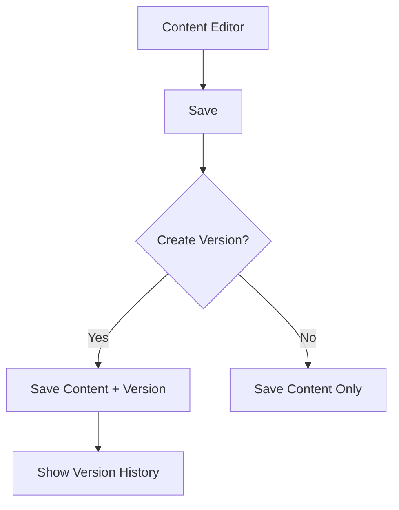

# Phase 13: Content Versioning System

## Overview
Implement a framework-free content versioning system for the CMS that:
- Tracks all content changes
- Allows rollback to previous versions
- Maintains version history
- Works within shared hosting constraints

## Technical Requirements
1. **Database Schema**:
   - New `content_versions` table
   - Relationship to existing `content` table
   - Version metadata storage

2. **Core Components**:
   - Version creation on content save
   - Version comparison UI
   - Rollback functionality
   - Automatic version pruning

3. **Implementation Plan**:
   - Week 1: Database migration and schema
   - Week 2: Version creation logic
   - Week 3: Version management UI
   - Week 4: Testing and deployment

## Database Migration
```php
// Example migration structure
class ContentVersioningMigration {
    public static function up() {
        // Create versions table
    }
    
    public static function down() {
        // Drop versions table
    }
}
```

## UI Mockup


## Testing Plan
1. Version creation tests
2. Rollback functionality tests
3. Performance benchmarks
4. Edge case testing

## Dependencies
- Existing content management system
- Database abstraction layer
- Authentication system