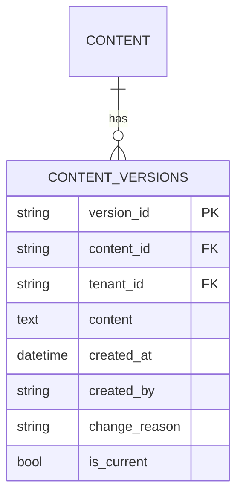

# Phase 13 Implementation: Content Versioning System

## 1. Database Schema

## 2. Migration Components
- New migration file: `Migration_0013_ContentVersioning.php`
- Migrates existing file versions to database
- Includes rollback procedure

## 3. Core Implementation
- Enhanced ContentVersioning class
- New API endpoints:
  - POST /api/content/{id}/versions
  - GET /api/content/{id}/versions
  - POST /api/content/{id}/rollback

## 4. UI Integration
- Version history panel
- Diff viewer
- Rollback confirmation

## 5. Testing Plan
- Unit tests for version operations
- Integration tests for API
- Performance tests under load

## 6. Implementation Timeline
1. Week 1: Database schema and migration
2. Week 2: Core versioning logic
3. Week 3: API endpoints
4. Week 4: UI integration