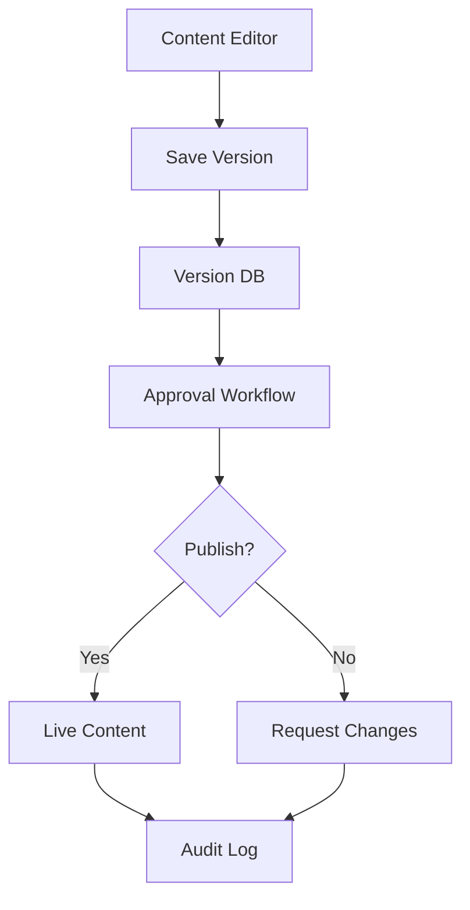

# Phase 14: Content Approval & Version Control

## 1. Objectives
- Enhance content approval workflow
- Implement version rollback mechanism
- Integrate with existing version control system
- Add audit logging for all operations

## 2. Architecture

## 3. Database Changes
1. Add columns to `versions` table:
   - `approval_state` ENUM('draft','review','approved','published','archived','rejected')
   - `approved_by` INT (user_id)
   - `approved_at` DATETIME

2. Enhance `version_metadata` table:
   - Add `transition_log` JSON for state changes
   - Add `rollback_to_version` INT (self-reference)

## 4. Implementation Steps

### 4.1 Approval Workflow Enhancements
- Extend ContentApproval class with:
  - State transition validation
  - Permission checks
  - Notification system

### 4.2 Version Rollback
- Create VersionRollback class with:
  - Content comparison
  - Conflict resolution
  - Audit trail

### 4.3 API Endpoints
- `/api/versions` - List versions
- `/api/versions/{id}/approve` - Approve version
- `/api/versions/{id}/rollback` - Rollback to version

### 4.4 UI Improvements
- Version comparison tool
- Approval dashboard
- Rollback confirmation flow

## 5. Testing Approach
1. Unit tests for state transitions
2. Integration tests for approval workflow
3. End-to-end tests for rollback functionality
4. Performance testing for version comparison

## 6. Timeline
- Week 1: Database changes + core functionality
- Week 2: API endpoints + UI components
- Week 3: Testing + documentation
- Week 4: Deployment + monitoring