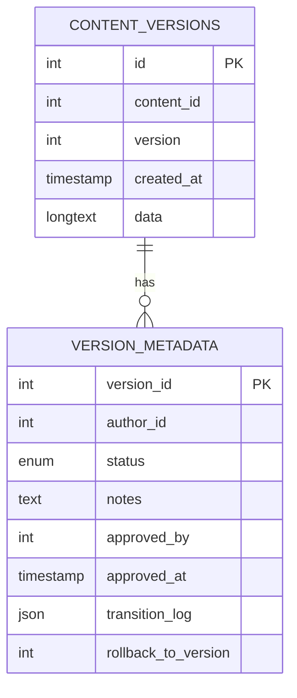
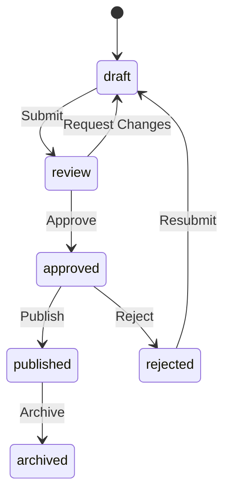

# Phase 14 Implementation Plan: Approval Workflow & Version Control

## 1. Database Changes

## 2. Workflow State Machine

## 3. Implementation Steps

### 3.1 Database Migration
1. Alter `version_metadata` table:
   - Add columns: approved_by, approved_at, transition_log, rollback_to_version
   - Expand status enum to include: 'review', 'published', 'archived', 'rejected'

### 3.2 Core Classes
1. `ContentApprovalWorkflow`:
   - State transition validation
   - Permission checks
   - Notification triggers

2. `VersionRollbackEngine`:
   - Content comparison
   - Conflict resolution
   - Audit logging

### 3.3 API Endpoints
1. `/api/versions/{id}/transition` - State transitions
2. `/api/versions/{id}/approve` - Approval endpoint
3. `/api/versions/{id}/rollback` - Rollback endpoint

### 3.4 Testing
1. Unit tests for state transitions
2. Integration tests for approval workflow
3. End-to-end tests for rollback
4. Performance tests for version comparison

## 4. Integration Points
1. Version control system:
   - Hook into version creation
   - Track state changes
   - Enable rollback

2. Analytics system:
   - Log approval/rejection metrics
   - Track time in each state

## 5. Timeline
- Week 1: Database changes + core workflow
- Week 2: API endpoints + integration
- Week 3: Testing + documentation
- Week 4: Deployment + monitoring