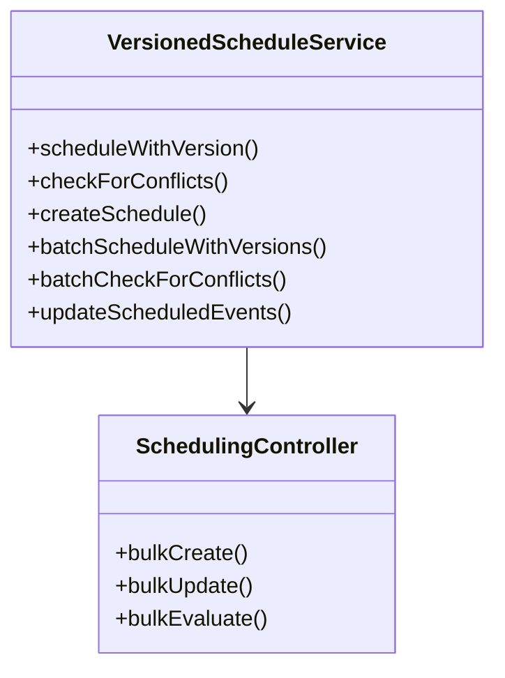

# Phase 3 Batch Processing Implementation Plan

## Current State Analysis
1. Existing batch endpoints (bulkCreate, bulkUpdate, bulkEvaluate)
2. Basic transaction handling in bulk operations
3. Individual permission checking
4. No batch conflict detection
5. No recurrence support

## Proposed Architecture

## Implementation Steps

1. **Extend VersionedScheduleService**
   - Add `batchScheduleWithVersions()` for bulk operations
   - Add `batchCheckForConflicts()` for batch conflict detection
   - Add `updateScheduledEvents()` for bulk updates

2. **Complete bulkUpdate Implementation**
   - Implement actual update logic in SchedulingController
   - Add transaction support
   - Add individual result tracking

3. **Add Batch Conflict Detection**
   - Extend conflict detection to handle multiple items
   - Add batch conflict resolution options

4. **Implement Recurrence Patterns**
   - Add recurrence field to scheduled_events table
   - Add recurrence handling in VersionedScheduleService
   - Add recurrence validation

5. **Add Status Tracking**
   - Utilize existing status enum
   - Add batch status tracking
   - Add error handling

## Dependencies
1. VersionControlService for version validation
2. Database for transaction support
3. SchedulingPermissionService for permission checks

## Risk Assessment
1. **Performance Impact**
   - Mitigation: Limit batch size, optimize queries
2. **Transaction Timeouts**
   - Mitigation: Break large batches into chunks
3. **Conflict Resolution Complexity**
   - Mitigation: Clear documentation, simple resolution options

## Shared Hosting Considerations
1. No long-running processes
2. No CLI requirements
3. PHP-only implementation
4. Minimal memory usage