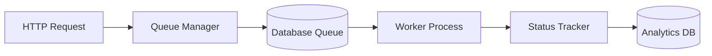

# Phase 3 Batch Processing Implementation Plan

## 1. Core Components

### Batch Job Queue System


- Database-backed queue using existing MySQL
- REST API endpoints for queue management
- Priority-based job ordering
- Job expiration handling

### Worker Processes
- PHP-based workers running via cron jobs
- Configurable batch sizes
- Process isolation for error containment
- Heartbeat monitoring

## 2. Integration Points

### VersionedScheduleService
```php
interface BatchScheduleInterface {
    public function createBatch(array $jobs);
    public function getBatchStatus(string $batchId);
    public function pauseBatch(string $batchId);
    public function resumeBatch(string $batchId);
}
```

### ConditionEvaluator
- Pre-execution condition checks
- Post-execution validation
- Conditional job chaining

## 3. Implementation Steps

1. Database Schema Updates
   - `batch_jobs` table
   - `batch_metadata` table
   - `batch_analytics` table

2. API Endpoints
   - POST /batch - Create new batch
   - GET /batch/{id} - Get batch status
   - GET /batch/{id}/jobs - List batch jobs
   - POST /batch/{id}/control - Pause/resume/cancel

3. Worker Implementation
   - PHP CLI scripts (cron-executed)
   - Status reporting via HTTP
   - Configurable retry logic

## 4. Risk Assessment

| Risk | Mitigation |
|------|------------|
| Long-running jobs | Timeout handling |
| Database locks | Optimistic concurrency |
| Worker failures | Heartbeat monitoring |
| Resource limits | Batch size tuning |