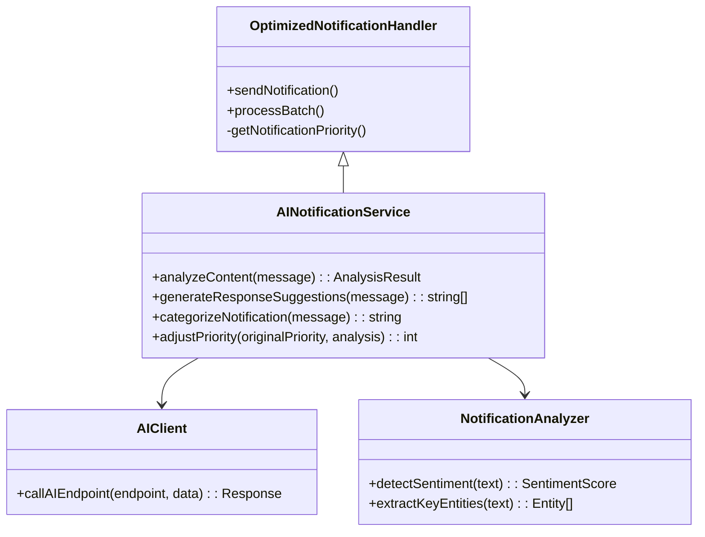

# Phase 4 AI Notification Service Design

## Overview
Extend OptimizedNotificationHandler with AI capabilities for:
- Smart categorization
- Sentiment analysis
- Response suggestions
- Enhanced prioritization

## Architecture

## Implementation Steps

1. **Service Files Creation**
   - `includes/services/AINotificationService.php`
   - `includes/services/AIClient.php`
   - `includes/services/NotificationAnalyzer.php`

2. **Database Enhancements**
   - Add `analysis_results` JSON column to notifications table
   - Create `notification_suggestions_cache` table

3. **Integration Points**
   - Hook into sendNotification() for analysis
   - Add admin UI for reviewing AI suggestions
   - Implement caching for frequent patterns

## Technical Requirements
- Framework-free PHP 8.1+
- REST API integration (OpenAI/Hugging Face)
- Shared hosting compatible
- No CLI dependencies
- n8n workflow support

## Testing Plan
1. Unit tests for analysis functions
2. Integration tests with mock AI responses
3. Performance testing for batch processing
4. Fallback mechanism verification