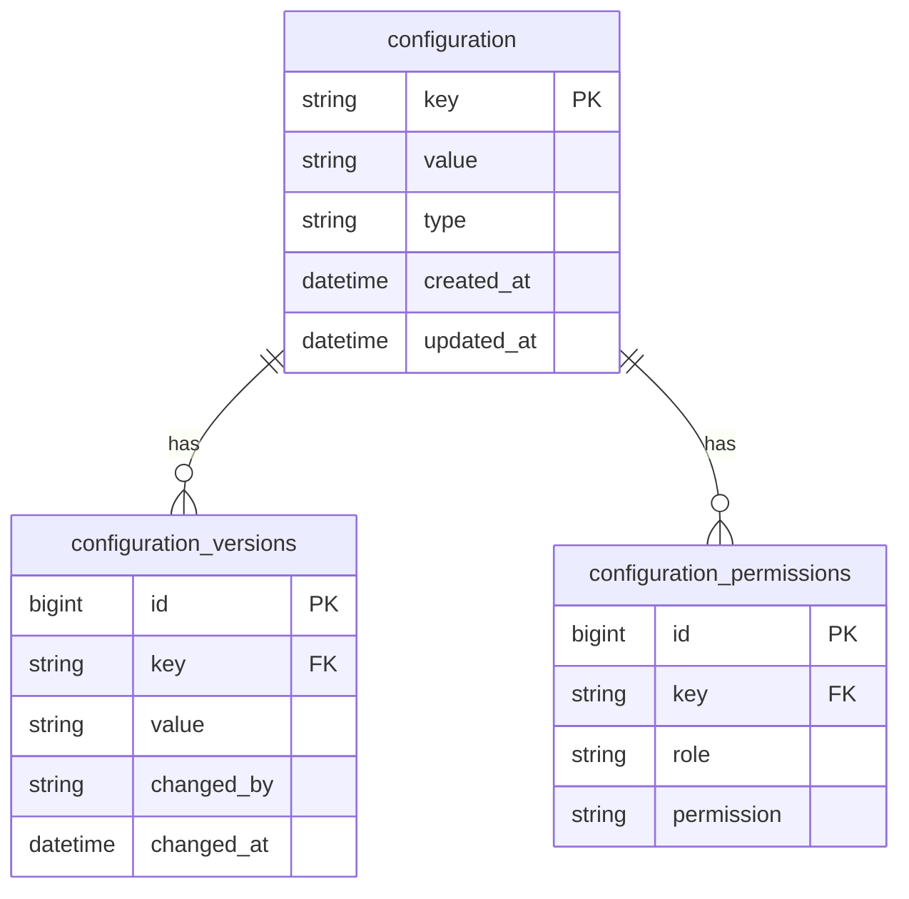

# Phase 4 Implementation Plan - Configuration & Auth Refactor

## 1. ConfigurationService Finalization
- **Location**: `services/ConfigurationService.php`
- **Required Updates**:
  - Add RBAC integration for config access control
  - Implement multi-tenant configuration support
  - Add database storage adapter (implement `ConfigStorageInterface`)
  - Add configuration versioning support

## 2. Authentication Refactor
- **Components**:
  - Update `SessionService` to use finalized ConfigurationService
  - Implement JWT support for API authentication
  - Add multi-factor authentication hooks
  - Standardize auth error responses

## 3. Database Schema Updates

## 4. Implementation Steps
1. **Week 1**: 
   - Complete ConfigurationService methods
   - Implement RBAC integration
   - Create database storage adapter

2. **Week 2**:
   - Update SessionService integration
   - Implement JWT support
   - Add configuration versioning

3. **Week 3**:
   - Create migration scripts
   - Update documentation
   - Perform integration testing

## 5. Testing Strategy
- Unit tests for all new ConfigurationService methods
- Integration tests with SessionService
- RBAC permission verification tests
- Multi-tenant configuration tests