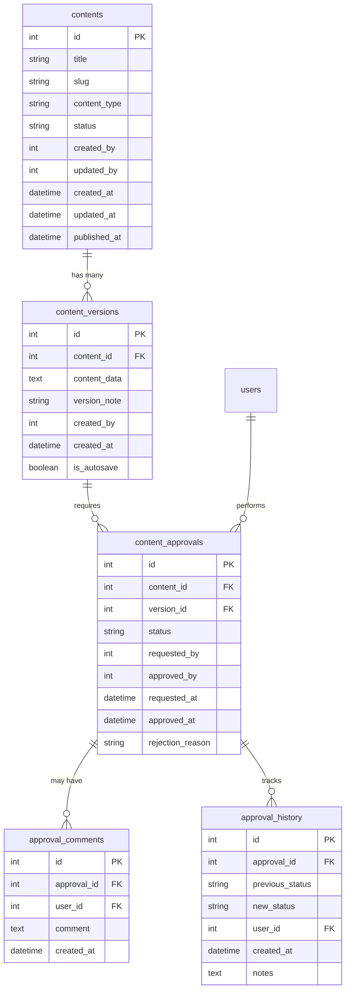
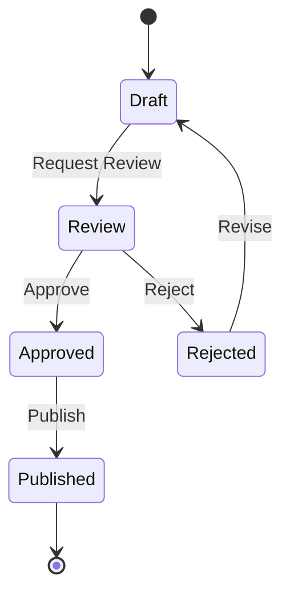
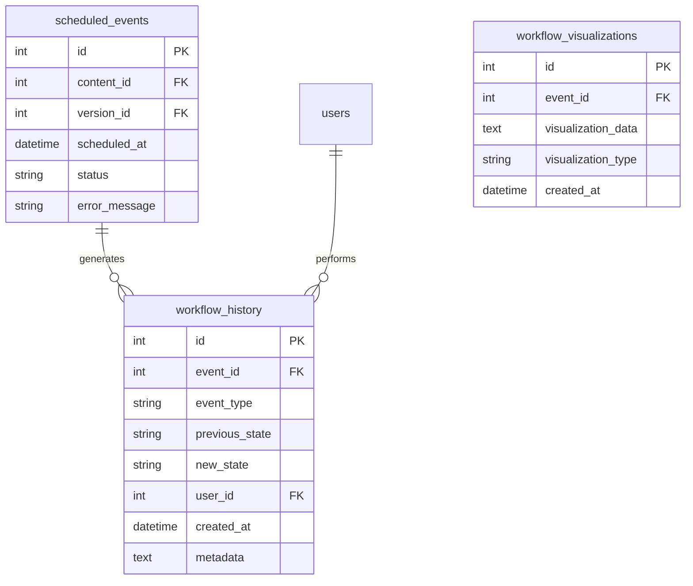
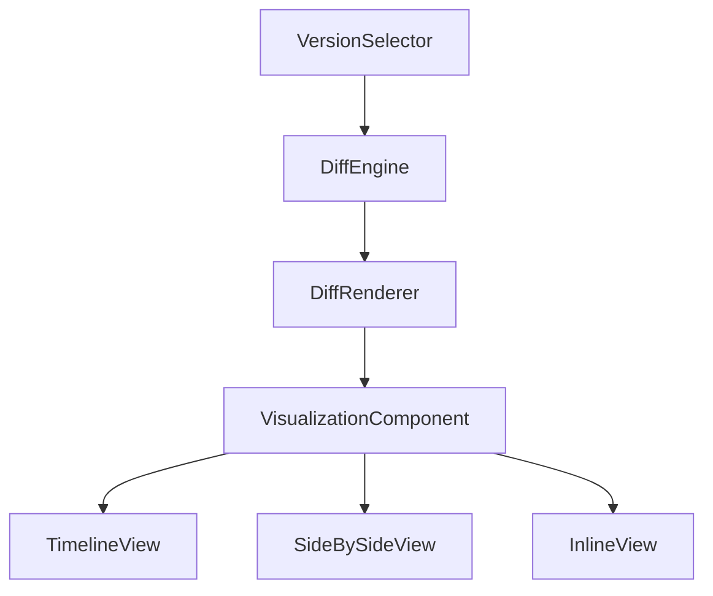
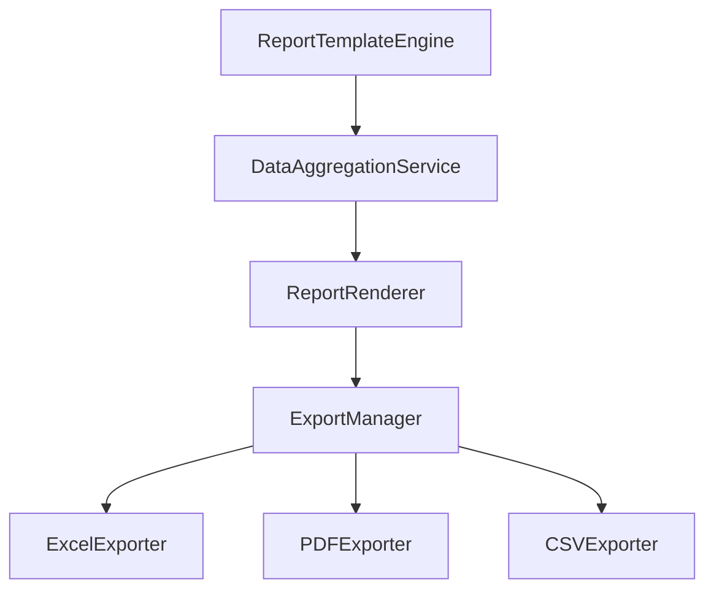

# Phase 4 CMS Development Implementation Plan

## Overview

This document outlines the implementation plan for Phase 4 of the CMS development, focusing on four key components:

1. Content Approval System Foundation
2. Workflow History Implementation
3. Version Comparison UI
4. Tenant Reporting System

All implementations will strictly adhere to framework-free PHP compliance, with no Laravel patterns, no CLI dependencies, and optimized for shared hosting environments.

## 1. Content Approval System Foundation

### Database Schema



### State Machine Implementation



### Key Components

1. **ApprovalStateManager Class**
   - Manages state transitions according to workflow rules
   - Validates user permissions for each action
   - Logs all state changes to approval_history
   - Implements a hybrid approach with standard base workflow that can be extended with content type-specific steps

2. **ContentApprovalService**
   - Handles approval requests, approvals, rejections
   - Manages approval comments
   - Integrates with existing ContentManager

3. **Admin UI Integration**
   - Add approval workflow controls to admin/clients/edit.php
   - Create approval history view
   - Implement comment system for reviewers

## 2. Workflow History Implementation

### Database Schema



### Key Components

1. **WorkflowHistoryTracker**
   - Hooks into ScheduleService events
   - Records all workflow state changes
   - Stores metadata for visualization

2. **HistoryVisualizationComponent**
   - Hybrid timeline/tabular visualization with toggle options
   - Filterable by event type, user, date range
   - Exportable to reports

3. **Integration with Scheduling Module**
   - Extend existing ScheduleService with history tracking
   - Add visualization to admin scheduling views
   - Create API endpoints for history data

## 3. Version Comparison UI

### Component Architecture



### Key Components

1. **Enhanced DiffEngine**
   - Extend existing DiffEngine with semantic comparison
   - Add support for structured content comparison
   - Implement chunked processing for large content sets
   - Optimize for shared hosting with memory limits

2. **VersionTimelineComponent**
   - Visual timeline of version history
   - Highlights approval states and publishing events
   - Interactive selection of versions to compare

3. **DiffVisualizationRenderer**
   - Multiple view modes (side-by-side, inline, summary)
   - Color-coded changes with highlighting
   - Collapsible sections for large documents

4. **Admin Dashboard Integration**
   - Add version comparison tab to content editor
   - Integrate with approval workflow
   - Add version restoration capabilities

### Shared Hosting Optimization

```php
// Optimized for shared hosting environments
public static function streamCompare($versionA, $versionB) {
    $chunkSize = 500; // Lines per chunk
    $memoryLimit = 64 * 1024 * 1024; // 64MB
    
    $fileA = fopen($versionA, 'r');
    $fileB = fopen($versionB, 'r');
    
    while (!feof($fileA) && !feof($fileB) && memory_get_usage() < $memoryLimit) {
        // Process in chunks to avoid memory issues
        yield self::compareChunk(
            fread($fileA, $chunkSize), 
            fread($fileB, $chunkSize)
        );
    }
    
    fclose($fileA);
    fclose($fileB);
}
```

## 4. Tenant Reporting System

### System Architecture



### Key Components

1. **ReportTemplateEngine**
   - Template-based report definition
   - Customizable layouts and components
   - Support for tenant-specific branding
   - Equal focus on templates and custom building

2. **DataAggregationLayer**
   - Query builder for report data
   - Caching for expensive queries
   - Support for custom metrics and KPIs

3. **Enhanced ExportIntegration**
   - Extend existing ExcelExporter
   - Add PDF export capabilities
   - Implement scheduled report generation

4. **Admin Interface**
   - Report builder UI
   - Saved report templates
   - Scheduling and distribution options

## Implementation Sequence

### Phase 1: Database Foundation (Week 1)
- Create database migrations for all new tables
- Implement base service classes
- Set up test endpoints

### Phase 2: Core Services (Week 2)
- Implement ApprovalStateManager
- Develop WorkflowHistoryTracker
- Create base reporting engine

### Phase 3: UI Components (Week 3)
- Develop version comparison components
- Implement approval workflow UI
- Create history visualization

### Phase 4: Integration & Testing (Week 4)
- Integrate all components
- Implement report templates
- Comprehensive testing

## Technical Considerations

1. **Framework-Free Compliance**
   - All components use pure PHP 8.1+
   - No external dependencies
   - Static methods for service classes
   - Proper error handling and transactions

2. **Performance Optimization**
   - Chunked processing for large datasets (500 lines/records per chunk)
   - Maximum memory usage: 64MB per operation
   - Timeout: 15s per chunk
   - Progressive loading for UI components

3. **Security Measures**
   - Role-based access control for all operations
   - Input validation and sanitization
   - Audit logging for sensitive actions

4. **Testing Strategy**
   - Unit tests for core services
   - Integration tests for workflows
   - Web-accessible test endpoints