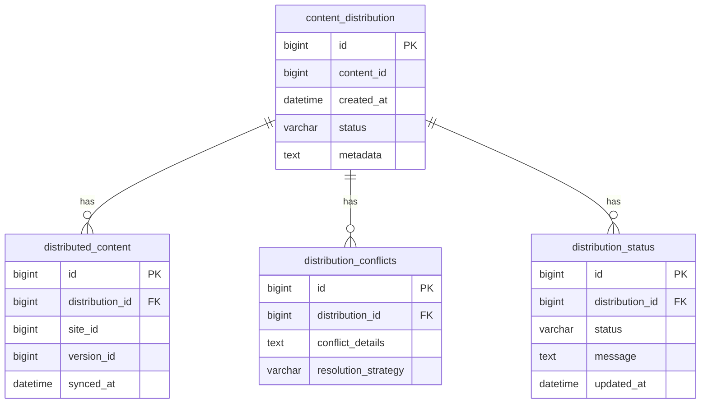

# Phase 4 Implementation Plan - Content Distribution System

## Core Architecture

### Services:
1. **ContentDistributionService** - Main orchestrator
2. **SiteSynchronizer** - Handles multi-site sync
3. **ConflictResolver** - Version conflict resolution
4. **DistributionTracker** - Status tracking

### Database Schema:

## Implementation Steps

### 1. Content Distribution Service
- Location: `includes/services/ContentDistributionService.php`
- Methods:
  - `distribute(content_id, target_sites)`
  - `getDistributionStatus(job_id)`
  - `cancelDistribution(job_id)`

### 2. Multi-site Synchronization
- Extend `SiteSynchronizer` class
- New methods:
  - `syncContent(content_id, sites)`
  - `getSyncStatus(sync_id)`

### 3. Version Conflict Resolution
- New service: `ConflictResolver.php`
- Conflict detection algorithms
- Resolution strategies (merge, overwrite, keep both)

### 4. Status Tracking
- Extend `BatchProcessor` tracking
- Add distribution-specific status codes
- Create admin dashboard widgets

## Integration Points
- VersionedScheduleService
- BatchProcessingService
- Content Management System

## Admin Interface Components
1. Distribution job list view
2. Conflict resolution UI
3. Real-time status dashboard
4. Distribution history/reports

## Documentation Updates
1. Update `memory-bank/progress.md`
2. Add API docs: `docs/api/content-distribution.md`
3. Create admin docs: `docs/admin/content-distribution.md`

## Timeline
1. Database migrations - Day 1
2. Core services - Days 2-3
3. Admin interface - Days 4-5
4. Testing & docs - Day 6