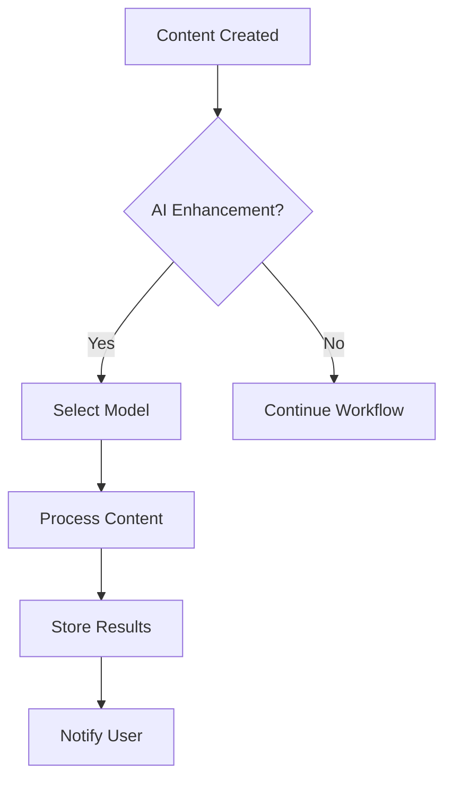

# Phase 4 AI Integration Implementation Plan

## 1. Model Integration Groups

### 🔷 Content Generation Models
```php
// config/ai_content_models.php
return [
    'claude3_opus' => [
        'api_endpoint' => 'https://api.anthropic.com/v1/complete',
        'capabilities' => ['blog_posts', 'landing_pages']
    ],
    'gpt4_turbo' => [
        'api_endpoint' => 'https://api.openai.com/v1/chat/completions',
        'capabilities' => ['structured_content', 'seo_optimization']  
    ]
    // Additional model configurations...
];
```

### 🔷 SEO & Metadata Models
```php
// config/ai_seo_models.php 
return [
    'phi3_mini' => [
        'api_endpoint' => 'https://huggingface.co/microsoft/phi-3-mini',
        'capabilities' => ['metadata', 'tagging']
    ]
    // Additional model configurations...
];
```

## 2. Modular API Endpoints
```
/api/ai/
├── /content/
│   ├── POST /generate - Content generation endpoint
│   └── POST /enhance - Content improvement
├── /seo/
│   ├── POST /analyze - SEO analysis
│   └── POST /optimize - SEO optimization
├── /image/
│   ├── POST /generate - Image generation
│   └── POST /edit - Image editing
└── /translation/
    ├── POST /translate - Text translation
    └── GET /languages - Supported languages
```

## 3. Implementation Tasks

### Core Modules:
1. `AICoreManager` - Base class for model integration
2. `AIContentGenerator` - Handles text generation
3. `AISEOAnalyzer` - Manages SEO operations
4. `AIImageService` - Image generation service
5. `AITranslationService` - Translation handler

### Database Tables:
```sql
CREATE TABLE ai_model_config (
    model_id VARCHAR(50) PRIMARY KEY,
    provider VARCHAR(50),
    endpoint VARCHAR(255),
    capabilities JSON,
    tenant_specific BOOLEAN DEFAULT false
);

CREATE TABLE tenant_ai_usage (
    tenant_id VARCHAR(36),
    model_id VARCHAR(50),
    usage_count INT DEFAULT 0,
    last_used DATETIME
);
```

## 4. Workflow Integration



## 5. Testing Strategy
1. Unit tests for each model adapter
2. Integration tests for workflow automation
3. Tenant isolation verification
4. Performance testing with multiple concurrent requests

## 6. Additional AI Features

### 🔷 Translation & Localization:
- Gemini Pro (context-aware, natural phrasing)
- Mistral Large (fast and direct translations)

### 🔷 Image Generation:
- SDXL (Stable Diffusion XL) – main model for illustrations
- DALL·E 3 (via GPT-4 API) – for images with text elements
- Playground V2 / V3 – creative, blog-style illustrations
- Leonardo.Ai – product mockups, stock photo style
- BlueWillow / Mage.Space – free open-source alternatives

### 🔷 Content Planning & AI Assistants:
- DeepSeek Chat V3 – sequential reasoning, planning, content flow
- Claude 3 Opus – copy editing, logic refinement
- Command R+ – extract structured data from unstructured input

## 7. Modular Integration Tasks
- AI Content Assistant
- AI SEO Generator
- AI Translator
- AI Metadata Extractor
- AI UX Writer
- AI Planner
- Image Generator (with selectable style presets)
- Thumbnail Creator
- Product Mockup Generator
- Blog Illustration Tool