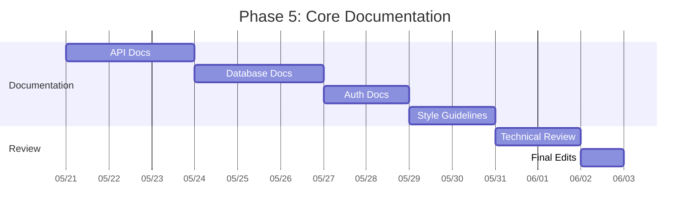

# Phase 5: Core Documentation Plan

## Documentation Structure
```
/docs
  /api - REST endpoint documentation
  /database - Schema and query documentation  
  /auth - Authentication flow documentation
  /style - Coding standards and guidelines
  /templates - Documentation templates
```

## Detailed Tasks

### 1. API Documentation
- Document all endpoints in `includes/Controllers/`
- Include:
  - HTTP method
  - Required parameters
  - Response format
  - Error codes
  - Example requests/responses
- Generate from PHPDoc where possible

### 2. Database Documentation
- Document all tables in Markdown format
- Include:
  - Table relationships
  - Field types and constraints
  - Indexes
  - Common query patterns
- Generate ER diagrams using Mermaid

### 3. Authentication Documentation
- Document:
  - Session management flow
  - RBAC implementation
  - Permission hierarchy
  - Security practices
- Include sequence diagrams

### 4. Code Style Guidelines
- Establish standards for:
  - PHP coding style
  - File/folder naming
  - Comment formatting
  - Error handling
- Create linting rules where possible

## Timeline


## Implementation Notes
- Use Markdown for all documentation
- Store diagrams in Mermaid format
- Maintain version history
- Automate generation where possible