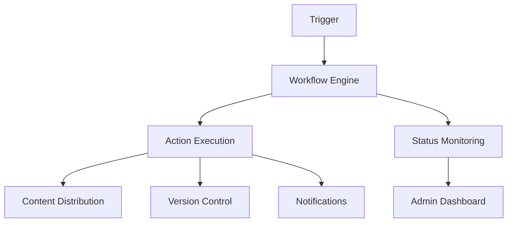

# Phase 5 Workflow Automation Implementation Plan

## 1. Workflow Engine Core
- Extend `WorkflowService` with:
  - Rule-based trigger evaluation
  - Parallel workflow execution
  - Error handling and retries
- Database tables:
  - `workflows` (existing)
  - `workflow_triggers` (new)
  - `workflow_actions` (new)

## 2. Rule-based Automation Triggers
- Implement `TriggerService` with:
  - Time-based triggers (cron expressions)
  - Content state triggers (published, archived)
  - User action triggers
- Integration with `ConditionEvaluator`

## 3. Action Execution System
- `ActionService` features:
  - Content publishing/archiving
  - Email/SMS notifications
  - Version rollback
  - n8n workflow integration
  - Plugin extension points

## 4. Status Monitoring
- Real-time dashboard:
  - Current workflow states
  - Execution history
  - Error reporting
- Logging to `workflow_events` table

## 5. Admin Interface Components
- Workflow builder UI
- Trigger configuration
- Action selection
- Monitoring dashboard

## Integration Points

## Implementation Steps
1. Database migrations for new tables
2. Core service implementations
3. Admin interface components
4. Integration testing
5. Documentation