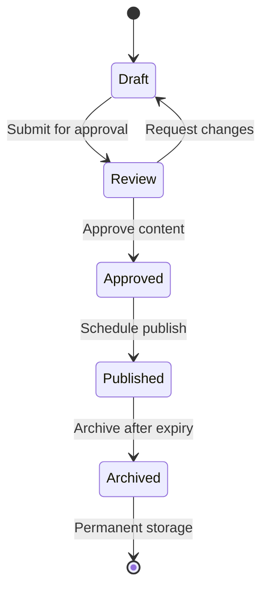

# Phase 5: Content Lifecycle Management Architecture

## State Transition Diagram


## Version Control Enhancements
- Content metadata tracking (author, change reason)
- Binary diffs for efficient storage
- Version tagging/labeling system
- Extended rollback capabilities

## Approval Workflows
- Role-based approval system
- Multi-stage approval chains
- Commenting/feedback integration
- Email notifications
- n8n workflow integration

## Automated Archiving
- Configurable rules (time/space-based)
- Cold storage integration
- Archive search functionality
- One-click restore

## Content Expiration
- Time-based expiration policies
- Owner notifications
- Grace period system
- Automated cleanup

## AI Integration Points
- AI-assisted version comparison
- Automated change summaries
- Content quality scoring
- Expiration risk assessment

## Database Schema Changes
```sql
ALTER TABLE content_versions ADD COLUMN change_reason TEXT;
ALTER TABLE content_versions ADD COLUMN is_major BOOLEAN DEFAULT FALSE;

CREATE TABLE content_states (
    content_id INT PRIMARY KEY,
    state ENUM('draft','review','approved','published','archived'),
    expires_at DATETIME,
    archived_at DATETIME,
    FOREIGN KEY (content_id) REFERENCES content(id)
);

CREATE TABLE approval_workflows (
    id INT AUTO_INCREMENT PRIMARY KEY,
    content_id INT,
    approver_id INT,
    status ENUM('pending','approved','rejected'),
    comments TEXT,
    created_at DATETIME DEFAULT CURRENT_TIMESTAMP,
    FOREIGN KEY (content_id) REFERENCES content(id),
    FOREIGN KEY (approver_id) REFERENCES users(id)
);
```

## Implementation Phases
1. Database migrations (db-support mode)
2. Core state machine (code mode)
3. Approval workflows (code mode)
4. Automated processes (orchestrator mode)
5. AI integrations (service-integrator mode)