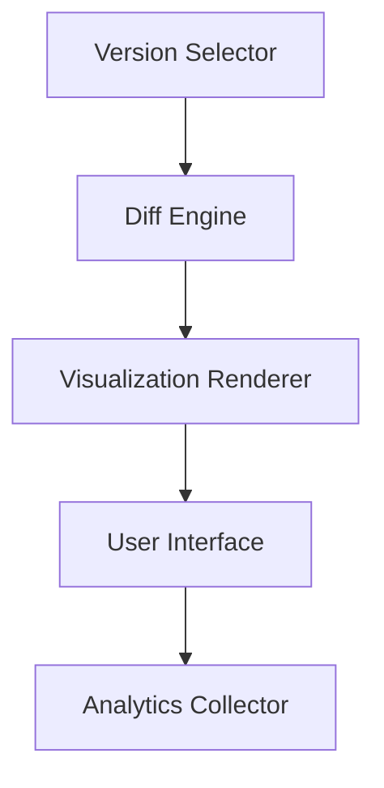

# Phase 6 Implementation Plan: Version Comparison System

## 1. Version Comparison Interface

- **Version Selector**: Dropdown to choose versions to compare
- **Diff Engine**: Utilize existing Myers diff algorithm
- **Visualization**: Side-by-side and inline diff views
- **UI Components**: 
  - Color-coded changes (green=added, red=removed, yellow=changed)
  - Collapsible sections
  - Word-level highlighting

## 2. Change Tracking Visualization
- **Visual Modes**:
  - Side-by-side comparison
  - Inline changes with highlights
  - Summary statistics view
- **Interactive Elements**:
  - Hover for change details
  - Click to expand/collapse sections
  - Filter by change type

## 3. Version Diff Algorithms
- Enhance existing DiffEngine with:
  - Semantic diff for structured content
  - Conflict detection markers
  - Performance optimizations for large documents

## 4. User Interaction Analytics

- **Track**:
  - Version comparisons performed
  - Changes reviewed
  - Time spent analyzing diffs
  - Restoration actions
- **Storage**: Use existing analytics_events table
- **Reporting**: Dashboard with metrics

## 5. Version Restoration Workflow
1. User selects version to restore
2. System shows preview of changes
3. User confirms restoration
4. System:
   - Creates new version with restoration metadata
   - Logs restoration event
   - Updates content

## Technical Considerations
- **Backward Compatibility**:
  - Maintain existing API contracts
  - Add new fields as optional
- **Shared Hosting**:
  - Memory-efficient diff processing
  - Chunked content comparison
  - Minimal external dependencies
- **FTP Deployment**:
  - Incremental update support
  - Version metadata included in exports

## Implementation Steps
1. Enhance DiffEngine with new visualization modes
2. Build Vue components for comparison interface
3. Implement analytics collection endpoints
4. Develop restoration API and UI
5. Optimize for shared hosting constraints
6. Test with large content sets
7. Document workflows and APIs