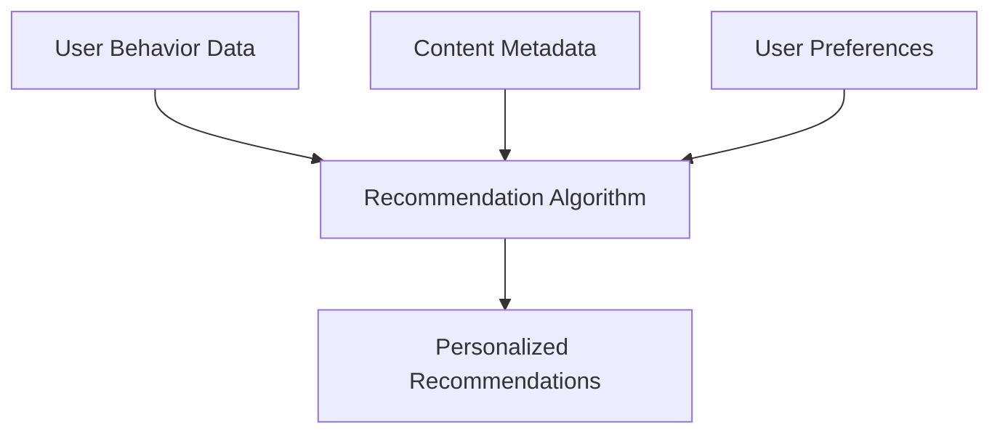
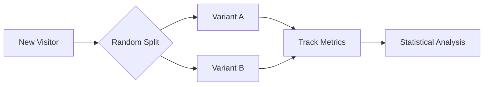

# Phase 7 Implementation Plan

## 1. Content Recommendation Engine


- **Implementation**:
  - Extend `PersonalizationModel` with recommendation algorithms
  - Add collaborative filtering based on user behavior
  - Implement content-based filtering using metadata
  - Create hybrid recommendation approach

## 2. Personalization Algorithms
- **Core Features**:
  - Real-time personalization based on:
    - User preferences
    - Browsing history
    - Engagement patterns
  - Contextual personalization (time, device, location)
  - Fallback to popular content when data is sparse

## 3. User Behavior Tracking
- **Schema**:
  ```sql
  CREATE TABLE IF NOT EXISTS user_behavior_events (
      event_id BIGINT PRIMARY KEY AUTO_INCREMENT,
      user_id INT,
      session_id VARCHAR(255),
      event_type VARCHAR(50),
      content_id INT,
      metadata JSON,
      created_at TIMESTAMP
  );
  ```

## 4. Recommendation Analytics
- **Metrics**:
  - Click-through rate
  - Conversion rate
  - Dwell time
  - Recommendation effectiveness score
- **Storage**:
  - Daily aggregated metrics
  - Raw event data for 30 days

## 5. A/B Testing Framework


- **Implementation**:
  - Cookie-based test assignment
  - Configurable test parameters
  - Automated significance testing
  - Results dashboard

## Backward Compatibility
- Maintain existing preference storage format
- Support legacy recommendation API endpoints
- Gradual rollout via feature flags

## Deployment Strategy
- Incremental FTP updates
- Database changes via migration scripts
- Configuration-based feature toggles