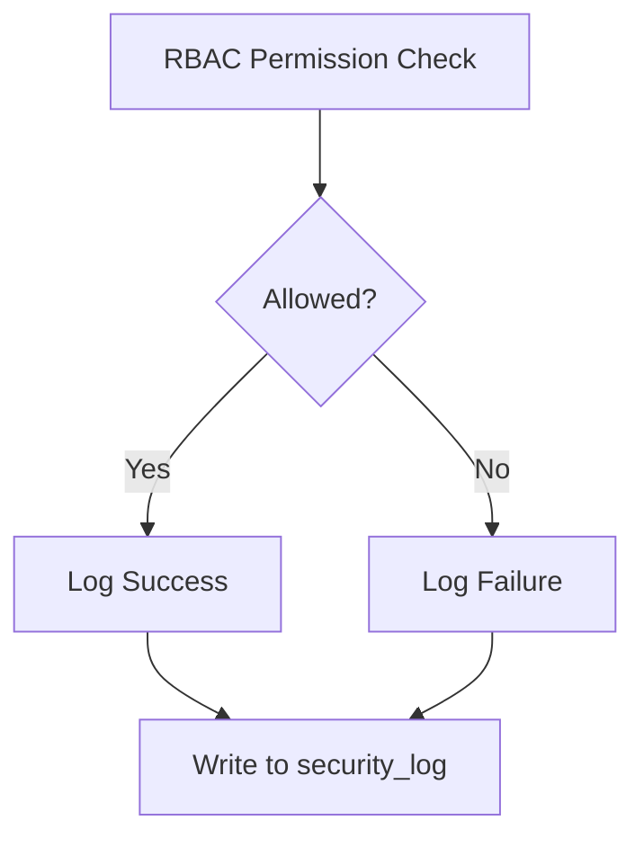

# Phase 7 Implementation Plan

## 1. Security Audit Logging


Implementation:
- Add logging to RBAC::checkPermission()
- Log format: 
  ```json
  {
    "timestamp": "ISO8601",
    "user_id": "int",
    "action": "string",
    "resource": "string",
    "allowed": "bool"
  }
  ```

## 2. Query Logging
- New DatabaseLogger class
- Log slow queries (>500ms)
- Capture:
  - SQL with sanitized parameters
  - Execution time
  - Call stack

## 3. Performance Monitoring
- Extend Heartbeat system:
  - Track memory usage
  - Log metrics hourly
  - Alert thresholds:
    - Memory > 80%
    - Response time > 2s