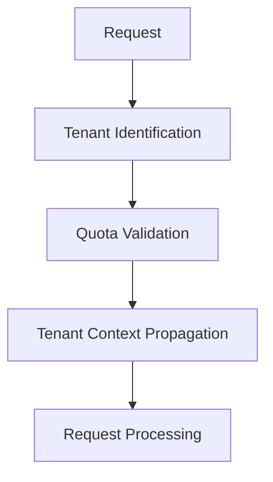

# Phase 7: Multi-Tenant Implementation Plan

## Overview
Complete implementation of multi-tenant architecture based on existing migration files:
- `database/migrations/2025_phase12_tenant_structure.php`
- `database/migrations/2025_phase12_tenant_scoped_data.php`
- `database/migrations/2025_phase12_tenant_rollback_procedures.php`

## Implementation Components

### 1. Tenant Request Handling

### 2. Admin Panel Enhancements
- Tenant management UI
- Quota monitoring dashboard
- Tenant activity logs

### 3. Quota Enforcement
- Resource usage tracking
- Quota limit enforcement
- Notification system

### 4. Cross-Tenant Features
- Content sharing workflows
- Shared resource management
- Access control

### 5. Lifecycle Management
- Tenant onboarding flows
- Suspension/archival procedures
- Data retention policies

## Implementation Order
1. Tenant request middleware
2. Admin panel UI
3. Quota enforcement
4. Cross-tenant features
5. Lifecycle management

## Testing Strategy
- Unit tests for isolation
- Integration tests for quotas
- End-to-end tenant workflows