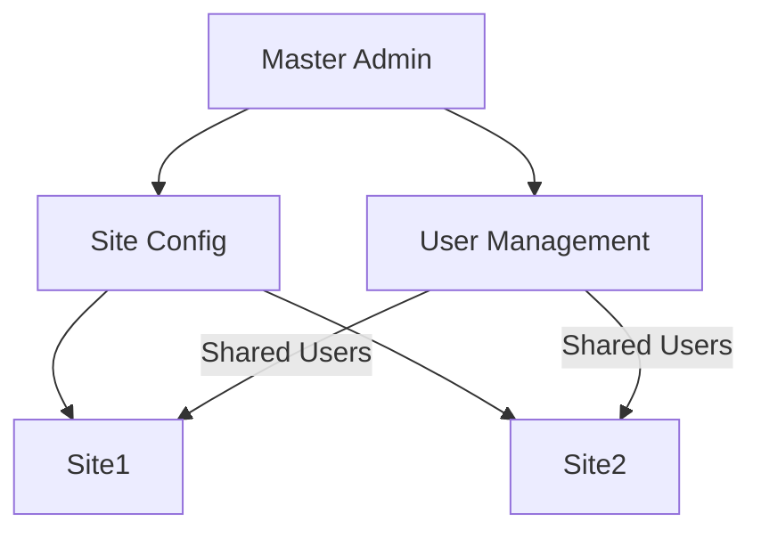

# Phase 8: Multi-Site Implementation Plan

## 1. Multi-Site Management System
### Architecture


### Implementation Details
- Extend `config/multisite.php` with:
  ```php
  'sites' => [
      'site1' => [
          'domain' => 'site1.example.com',
          'theme' => 'corporate',
          'storage_limit' => '500MB'
      ]
  ],
  'default_roles' => [
      'editor' => ['content.create', 'content.edit']
  ]
  ```
- New `SiteManager` class responsibilities:
  - Site registration/removal
  - Resource allocation tracking
  - Configuration validation

## 2. Centralized Content Distribution
### Workflow
1. Content created in master site
2. Tagged with distribution metadata
3. Syndicated to target sites via:
   - Direct filesystem copy (local sites)
   - REST API (remote sites)
4. Version tracking maintained

## 3. Cross-Site Analytics
### Data Model Changes
```sql
ALTER TABLE analytics_events 
ADD COLUMN site_id VARCHAR(50) NOT NULL DEFAULT 'primary';
```

### Aggregation Service
- New methods in `AnalyticsService`:
  ```php
  public function getCrossSiteReport(array $siteIds, DateRange $range): array
  public function getTopContentAcrossSites(int $limit = 10): array
  ```

## 4. Shared User Authentication
### Security Model
- Single JWT token valid across all sites
- Role inheritance:
  ```
  Global Admin > Site Admin > Editor > Contributor
  ```
- Audit logging:
  ```php
  $logger->logAuthEvent(
      $userId, 
      'cross_site_login', 
      ['sites' => $accessedSites]
  );
  ```

## 5. Template Inheritance System
### Resolution Order
1. `themes/site1/templates/`
2. `themes/parent/templates/` 
3. `themes/core/templates/`

### New Theme Methods
```php
public function resolveTemplatePath(string $template): string {
    // Checks site-specific, then parent, then core
}
```

## Backward Compatibility
- All new features disabled by default
- Existing single-site mode remains unchanged
- Migration path:
  ```php
  if (config('multisite.enabled')) {
      // New multisite logic
  } else {
      // Legacy single-site behavior
  }
  ```

## Deployment Strategy
- Each site as separate zip package
- Manifest file tracks incremental changes
- Atomic updates using versioned directories