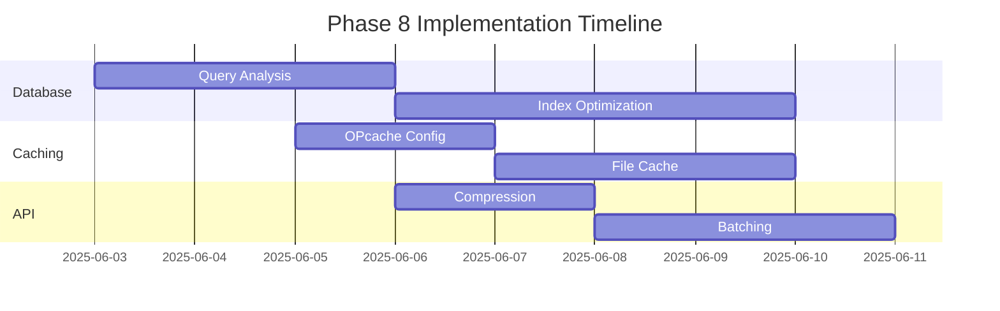

# Phase 8 Performance Optimization Plan

## Objectives
- Improve system response times by 40%
- Reduce database load by 50%
- Implement comprehensive caching strategy
- Optimize asset delivery
- Enhance API performance

## Optimization Areas

### 1. Database Optimization
- [ ] Implement query caching layer
- [ ] Add missing indexes (audit required)
- [ ] Optimize table structures
- [ ] Setup connection pooling

### 2. Caching Implementation
- [ ] Configure OPcache settings
- [ ] Create file-based cache system
- [ ] Implement cache invalidation
- [ ] Add cache monitoring

### 3. Asset Delivery
- [ ] Minify CSS/JS assets
- [ ] Implement lazy loading
- [ ] Setup asset versioning
- [ ] Configure browser caching

### 4. API Enhancements
- [ ] Add response compression
- [ ] Implement request batching
- [ ] Optimize JSON serialization
- [ ] Setup rate limiting

### 5. Monitoring
- [ ] Create performance endpoints
- [ ] Build metrics dashboard
- [ ] Setup alert system
- [ ] Document procedures

## Timeline

## Success Metrics
- Page load time ≤ 800ms
- Database queries ≤ 100ms
- API response size ≤ 50kb
- Cache hit rate ≥ 60%