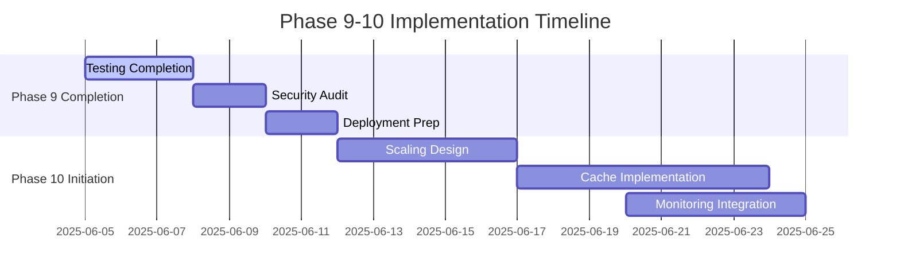

# Phase 9-10 Implementation Plan

## Current Phase Assessment (Phase 9: Content Federation)

### Core Engine Status
✅ Tenant identification system implemented  
✅ Site provisioning workflow complete  
✅ Configuration inheritance working  
✅ Content sharing protocol defined  
⚠️ Permission propagation needs testing  

### API Integration Status
✅ Core endpoints implemented  
✅ Tenant isolation middleware working  
✅ Error handling standards defined  
⚠️ Permission validation needs performance testing  

### Testing Status
✅ Automated test framework operational  
✅ Performance benchmarks established  
⚠️ Security audit checklist incomplete  

### Deployment Readiness
✅ Database migration procedures defined  
✅ Test endpoint verification complete  
⚠️ Deployment checklist incomplete  

## Next Phase Requirements (Phase 10: Scaling & Optimization)

### Core Requirements
1. Horizontal scaling for federation hub
2. Content caching layer
3. Bulk operation optimization
4. Enhanced monitoring

### Technical Dependencies
- Phase 9 testing completion
- Performance metrics collection
- Load testing infrastructure

## Task Breakdown

## Resource Allocation

| Resource          | Phase 9 Tasks          | Phase 10 Tasks         |
|-------------------|------------------------|------------------------|
| Backend (2)      | Testing completion     | Scaling implementation |
| Frontend (1)     | Audit UI               | Monitoring dashboard   |
| DevOps (1)       | Deployment prep        | Cache configuration    |
| QA (1)           | Security testing       | Load testing           |

## Risk Mitigation
1. **Testing Delays**: Allocate additional QA resources
2. **Performance Issues**: Implement progressive rollout
3. **Resource Constraints**: Prioritize core federation features

## Architectural Decisions Logged
1. Standardized migration pattern (static methods only)
2. Web-accessible migration endpoints
3. Tenant isolation at middleware layer