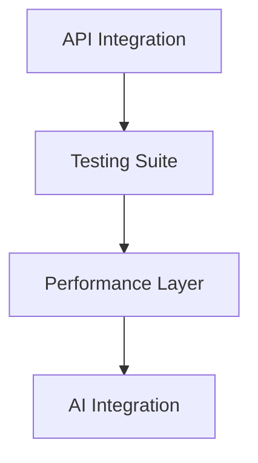

# Phase 9-10 Task Breakdown

## Current Phase Assessment (Phase 9)
- **Status**: Core engine implemented, API integration in progress
- **Completed**:
  - Content sharing engine
  - Version control system
  - Basic tenant isolation
- **Pending**:
  - Performance optimizations
  - Advanced conflict resolution
  - Bulk operations

## Next Phase Requirements (Phase 10)
1. **Performance Enhancements**
   - Content delivery optimizations
   - Database query caching
   - Async processing

2. **Advanced Features**
   - AI-assisted conflict resolution
   - Multi-tenant analytics
   - Workflow automation

## Task Breakdown

### Phase 9 Remaining Tasks
1. **API Integration** (3 days)
   - [ ] Implement REST endpoints
   - [ ] Add rate limiting
   - [ ] Create documentation

2. **Testing Suite** (2 days)
   - [ ] Unit tests
   - [ ] Integration tests
   - [ ] Load testing

### Phase 10 Tasks
1. **Performance Layer** (5 days)
   - [ ] Cache implementation
   - [ ] Query optimization
   - [ ] Async job queue

2. **AI Integration** (4 days)
   - [ ] Conflict resolution model
   - [ ] Content suggestions
   - [ ] Automated tagging

## Dependencies

## Resource Allocation
| Task               | Developer | QA   | Days |
|--------------------|-----------|------|------|
| API Integration    | Dev1      | QA1  | 3    |
| Testing Suite      | Dev2      | QA2  | 2    |
| Performance Layer  | Dev1      | QA1  | 5    |
| AI Integration     | Dev3      | QA2  | 4    |