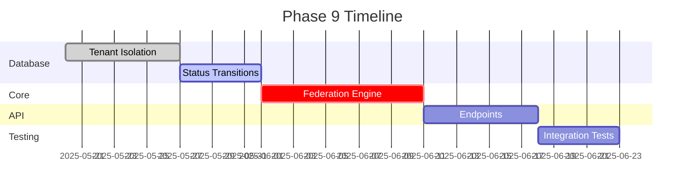

# Phase 9 Implementation Plan

## 1. Overview
Implement multi-tenant content federation system with:
- Tenant isolation at database level
- Content sharing between tenants
- API endpoints for federation operations
- Status transition tracking

## 2. Milestones

## 3. Task Breakdown

### 3.1 Database Migrations
1. **Tenant Isolation**
   - Add tenant_id to all tenant-specific tables
   - Modify indexes and constraints
   - Update query builder to enforce tenant scope
   - Test cases for tenant isolation

2. **Status Transitions**
   - Create status_transitions table
   - Implement logging triggers
   - Rollback procedures
   - Test cases for transition logging

### 3.2 Core Engine
1. **Tenant Management**
   - Tenant identification middleware
   - Configuration inheritance system
   - Tenant validation service

2. **Content Federation**
   - Sharing protocol implementation
   - Version synchronization
   - Conflict resolution strategies
   - Audit logging

### 3.3 API Integration
1. **Endpoint Development**
   - Tenant context endpoints
   - Content sharing endpoints
   - Bulk operations support
   - Detailed error responses

2. **Security**
   - Tenant isolation middleware
   - Rate limiting per tenant
   - Permission validation

### 3.4 Testing
1. **Unit Tests**
   - Tenant isolation verification
   - Federation logic
   - API response formats

2. **Integration Tests**
   - Cross-tenant operations
   - Error scenarios
   - Performance benchmarks

## 4. Risk Assessment
| Risk | Mitigation |
|------|------------|
| Tenant data leakage | Strict query builder enforcement |
| Performance degradation | Tenant-specific caching |
| API abuse | Rate limiting implementation |
| Migration failures | Comprehensive rollback tests |

## 5. Resource Allocation
- **Database**: db-support mode
- **Core Engine**: code mode
- **API**: code mode
- **Testing**: debug mode

## 6. Documentation
- Update API documentation
- Create admin guides for federation
- Add developer notes for tenant context