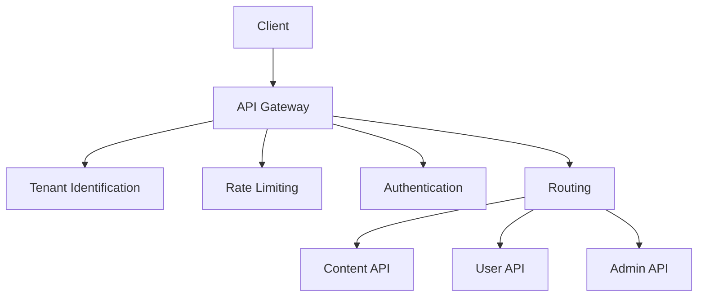

# Phase 9 API Gateway Implementation Plan

## Architecture Overview

## Implementation Phases

### Phase 1: Gateway Foundation (2 weeks)
- Create `/api-gateway/` directory structure
- Implement core request pipeline
- Basic authentication middleware
- Documentation standards

### Phase 2: API Integration (3 weeks)
- Migrate existing endpoints
- Versioning support
- Testing framework
- Monitoring hooks

### Phase 3: Advanced Features (2 weeks)
- Rate limiting implementation
- Bulk operations support
- Performance optimization

## Key Components

### Tenant Identification
- X-Tenant-Context header validation
- Tenant-aware request processing
- Isolation middleware

### Rate Limiting
- Global and per-tenant buckets
- Redis/file-based counters
- Adaptive throttling

### Authentication
- JWT validation
- API key support
- Session-based auth for admin

## Success Metrics
- 100% API traffic through gateway
- <100ms added latency
- Zero downtime migrations

## Documentation
- API reference in `/docs/api.md`
- Gateway architecture diagram
- Migration guide for plugins